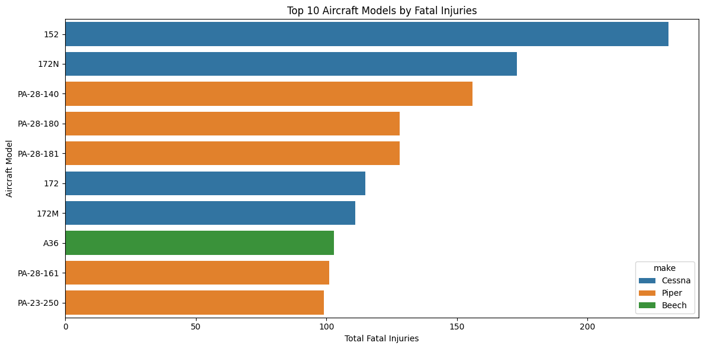

# Mawingu Airlines Aviation Expansion Project ✈️

## Overview
Mawingu Airlines is exploring the potential to expand its business operations into the aviation sector. This data science project aims to assess the viability of acquiring aircraft based on a thorough analysis of aviation accident data. The final objective is to recommend low-risk aircraft for potential investment using data-driven insights.
## Business Understanding
With the aviation industry being capital intensive and risk-laden, Mawingu Airlines seeks to minimize investment risk by relying on historical data. The key business questions are:
- What aircraft types are most prone to accidents?
- Are there patterns in aircraft accidents based on time, location, or flight phase?
- Which aircraft characteristics correlate with low incident rates?

The stakeholders include Mawingu Airlines' executive board and the new aviation division tasked with implementing expansion strategy.
## Data Understanding and Analysis

### 📂 Source of Data
The dataset is sourced from the **National Transportation Safety Board (NTSB)**, covering aviation accident data from **1962 to 2023**. It includes records of civil aviation accidents and selected incidents across the United States and international waters. It was compiled into a dataset known as ***Aviation.csv***

### 📊 Description of Data
The dataset includes:
- Aircraft make and model
- Date and location of incidents
- Flight phase during the incident
- Injury severity
- Weather conditions
- - Flight purpose and more

Initial cleaning revealed substantial missing data in some columns:
- Columns with >80% missing data (e.g., `Schedule`, `Air.carrier`) were dropped.
- Moderate and low-missing columns were imputed or cleaned for analysis.
- ## Visualizations

### 1. Top 10 Aircraft Models by Fatal Injuries

> A bar chart showing the top 10 aircraft models with the highest total number of fatal injuries.
> 
>  🟥 **Insight:** The **Cessna 152** and aircraft from **Cessna** and **Piper** brands appear frequently, suggesting high safety concerns.
