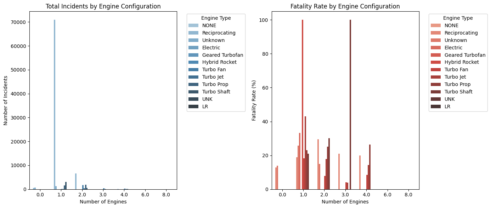

# AVIATION EXPANSION PROJECT

## Description

Mawingu Airlines has recently enjoyed a run of success, and now we feel that now is the right time to expand our ventures, specifically in the aviation industry. This project seeks to establish whether that path is viable at this point in time by conducting a thorough analysis of data related to various aircraft models. We will determine which aircraft are the lowest risk for the company to start this new business endeavor and then translate your findings into actionable insights that the head of the new aviation division can use to help decide which aircraft to purchase.

## Methodology

The data in focus is contained in the *Aviation dataset* from the National Transportation Safety Board that includes aviation accident data from 1962 to 2023 about civil aviation accidents and selected incidents in the United States and international waters. Our key areas of focus will be three areas:
- **Data Cleaning and Imputation**: We will perform key cleaning techniques on our data and filling in missing values
-  **Data Analysis**: Analysis of key metrics needed for insights into the business
-  **Data Vizualizations**: Graphical vizualization of the key metrics

## 1. Data Cleaning and Imputation

As explained earlier, our data is contained in the *Aviation Dataset* which we will load using the *Pandas* library. This will make viewing our data easier and enable cleaning of the data to be fast and efficient. As always, we will import pandas using the standard alias and read it into our notebook.


```python
import pandas as pd
Aviation_data = pd.read_csv('Aviation_Data.csv')
Aviation_data.head(20)
```

    C:\Users\USER\AppData\Local\Temp\ipykernel_8244\1316027294.py:2: DtypeWarning: Columns (6,7,28) have mixed types. Specify dtype option on import or set low_memory=False.
      Aviation_data = pd.read_csv('Aviation_Data.csv')
    


<div>
<style scoped>
    .dataframe tbody tr th:only-of-type {
        vertical-align: middle;
    }

    .dataframe tbody tr th {
        vertical-align: top;
    }

    .dataframe thead th {
        text-align: right;
    }
</style>
<table border="1" class="dataframe">
  <thead>
    <tr style="text-align: right;">
      <th></th>
      <th>Event.Id</th>
      <th>Investigation.Type</th>
      <th>Accident.Number</th>
      <th>Event.Date</th>
      <th>Location</th>
      <th>Country</th>
      <th>Latitude</th>
      <th>Longitude</th>
      <th>Airport.Code</th>
      <th>Airport.Name</th>
      <th>...</th>
      <th>Purpose.of.flight</th>
      <th>Air.carrier</th>
      <th>Total.Fatal.Injuries</th>
      <th>Total.Serious.Injuries</th>
      <th>Total.Minor.Injuries</th>
      <th>Total.Uninjured</th>
      <th>Weather.Condition</th>
      <th>Broad.phase.of.flight</th>
      <th>Report.Status</th>
      <th>Publication.Date</th>
    </tr>
  </thead>
  <tbody>
    <tr>
      <th>0</th>
      <td>20001218X45444</td>
      <td>Accident</td>
      <td>SEA87LA080</td>
      <td>1948-10-24</td>
      <td>MOOSE CREEK, ID</td>
      <td>United States</td>
      <td>NaN</td>
      <td>NaN</td>
      <td>NaN</td>
      <td>NaN</td>
      <td>...</td>
      <td>Personal</td>
      <td>NaN</td>
      <td>2.0</td>
      <td>0.0</td>
      <td>0.0</td>
      <td>0.0</td>
      <td>UNK</td>
      <td>Cruise</td>
      <td>Probable Cause</td>
      <td>NaN</td>
    </tr>
    <tr>
      <th>1</th>
      <td>20001218X45447</td>
      <td>Accident</td>
      <td>LAX94LA336</td>
      <td>1962-07-19</td>
      <td>BRIDGEPORT, CA</td>
      <td>United States</td>
      <td>NaN</td>
      <td>NaN</td>
      <td>NaN</td>
      <td>NaN</td>
      <td>...</td>
      <td>Personal</td>
      <td>NaN</td>
      <td>4.0</td>
      <td>0.0</td>
      <td>0.0</td>
      <td>0.0</td>
      <td>UNK</td>
      <td>Unknown</td>
      <td>Probable Cause</td>
      <td>19-09-1996</td>
    </tr>
    <tr>
      <th>2</th>
      <td>20061025X01555</td>
      <td>Accident</td>
      <td>NYC07LA005</td>
      <td>1974-08-30</td>
      <td>Saltville, VA</td>
      <td>United States</td>
      <td>36.922223</td>
      <td>-81.878056</td>
      <td>NaN</td>
      <td>NaN</td>
      <td>...</td>
      <td>Personal</td>
      <td>NaN</td>
      <td>3.0</td>
      <td>NaN</td>
      <td>NaN</td>
      <td>NaN</td>
      <td>IMC</td>
      <td>Cruise</td>
      <td>Probable Cause</td>
      <td>26-02-2007</td>
    </tr>
    <tr>
      <th>3</th>
      <td>20001218X45448</td>
      <td>Accident</td>
      <td>LAX96LA321</td>
      <td>1977-06-19</td>
      <td>EUREKA, CA</td>
      <td>United States</td>
      <td>NaN</td>
      <td>NaN</td>
      <td>NaN</td>
      <td>NaN</td>
      <td>...</td>
      <td>Personal</td>
      <td>NaN</td>
      <td>2.0</td>
      <td>0.0</td>
      <td>0.0</td>
      <td>0.0</td>
      <td>IMC</td>
      <td>Cruise</td>
      <td>Probable Cause</td>
      <td>12-09-2000</td>
    </tr>
    <tr>
      <th>4</th>
      <td>20041105X01764</td>
      <td>Accident</td>
      <td>CHI79FA064</td>
      <td>1979-08-02</td>
      <td>Canton, OH</td>
      <td>United States</td>
      <td>NaN</td>
      <td>NaN</td>
      <td>NaN</td>
      <td>NaN</td>
      <td>...</td>
      <td>Personal</td>
      <td>NaN</td>
      <td>1.0</td>
      <td>2.0</td>
      <td>NaN</td>
      <td>0.0</td>
      <td>VMC</td>
      <td>Approach</td>
      <td>Probable Cause</td>
      <td>16-04-1980</td>
    </tr>
    <tr>
      <th>5</th>
      <td>20170710X52551</td>
      <td>Accident</td>
      <td>NYC79AA106</td>
      <td>1979-09-17</td>
      <td>BOSTON, MA</td>
      <td>United States</td>
      <td>42.445277</td>
      <td>-70.758333</td>
      <td>NaN</td>
      <td>NaN</td>
      <td>...</td>
      <td>NaN</td>
      <td>Air Canada</td>
      <td>NaN</td>
      <td>NaN</td>
      <td>1.0</td>
      <td>44.0</td>
      <td>VMC</td>
      <td>Climb</td>
      <td>Probable Cause</td>
      <td>19-09-2017</td>
    </tr>
    <tr>
      <th>6</th>
      <td>20001218X45446</td>
      <td>Accident</td>
      <td>CHI81LA106</td>
      <td>1981-08-01</td>
      <td>COTTON, MN</td>
      <td>United States</td>
      <td>NaN</td>
      <td>NaN</td>
      <td>NaN</td>
      <td>NaN</td>
      <td>...</td>
      <td>Personal</td>
      <td>NaN</td>
      <td>4.0</td>
      <td>0.0</td>
      <td>0.0</td>
      <td>0.0</td>
      <td>IMC</td>
      <td>Unknown</td>
      <td>Probable Cause</td>
      <td>06-11-2001</td>
    </tr>
    <tr>
      <th>7</th>
      <td>20020909X01562</td>
      <td>Accident</td>
      <td>SEA82DA022</td>
      <td>1982-01-01</td>
      <td>PULLMAN, WA</td>
      <td>United States</td>
      <td>NaN</td>
      <td>NaN</td>
      <td>NaN</td>
      <td>BLACKBURN AG STRIP</td>
      <td>...</td>
      <td>Personal</td>
      <td>NaN</td>
      <td>0.0</td>
      <td>0.0</td>
      <td>0.0</td>
      <td>2.0</td>
      <td>VMC</td>
      <td>Takeoff</td>
      <td>Probable Cause</td>
      <td>01-01-1982</td>
    </tr>
    <tr>
      <th>8</th>
      <td>20020909X01561</td>
      <td>Accident</td>
      <td>NYC82DA015</td>
      <td>1982-01-01</td>
      <td>EAST HANOVER, NJ</td>
      <td>United States</td>
      <td>NaN</td>
      <td>NaN</td>
      <td>N58</td>
      <td>HANOVER</td>
      <td>...</td>
      <td>Business</td>
      <td>NaN</td>
      <td>0.0</td>
      <td>0.0</td>
      <td>0.0</td>
      <td>2.0</td>
      <td>IMC</td>
      <td>Landing</td>
      <td>Probable Cause</td>
      <td>01-01-1982</td>
    </tr>
    <tr>
      <th>9</th>
      <td>20020909X01560</td>
      <td>Accident</td>
      <td>MIA82DA029</td>
      <td>1982-01-01</td>
      <td>JACKSONVILLE, FL</td>
      <td>United States</td>
      <td>NaN</td>
      <td>NaN</td>
      <td>JAX</td>
      <td>JACKSONVILLE INTL</td>
      <td>...</td>
      <td>Personal</td>
      <td>NaN</td>
      <td>0.0</td>
      <td>0.0</td>
      <td>3.0</td>
      <td>0.0</td>
      <td>IMC</td>
      <td>Cruise</td>
      <td>Probable Cause</td>
      <td>01-01-1982</td>
    </tr>
    <tr>
      <th>10</th>
      <td>20020909X01559</td>
      <td>Accident</td>
      <td>FTW82DA034</td>
      <td>1982-01-01</td>
      <td>HOBBS, NM</td>
      <td>United States</td>
      <td>NaN</td>
      <td>NaN</td>
      <td>NaN</td>
      <td>NaN</td>
      <td>...</td>
      <td>Personal</td>
      <td>NaN</td>
      <td>0.0</td>
      <td>0.0</td>
      <td>0.0</td>
      <td>1.0</td>
      <td>VMC</td>
      <td>Approach</td>
      <td>Probable Cause</td>
      <td>01-01-1982</td>
    </tr>
    <tr>
      <th>11</th>
      <td>20020909X01558</td>
      <td>Accident</td>
      <td>ATL82DKJ10</td>
      <td>1982-01-01</td>
      <td>TUSKEGEE, AL</td>
      <td>United States</td>
      <td>NaN</td>
      <td>NaN</td>
      <td>NaN</td>
      <td>TUSKEGEE</td>
      <td>...</td>
      <td>Personal</td>
      <td>NaN</td>
      <td>0.0</td>
      <td>0.0</td>
      <td>0.0</td>
      <td>1.0</td>
      <td>VMC</td>
      <td>Landing</td>
      <td>Probable Cause</td>
      <td>01-01-1982</td>
    </tr>
    <tr>
      <th>12</th>
      <td>20020917X02148</td>
      <td>Accident</td>
      <td>FTW82FRJ07</td>
      <td>1982-01-02</td>
      <td>HOMER, LA</td>
      <td>United States</td>
      <td>NaN</td>
      <td>NaN</td>
      <td>NaN</td>
      <td>NaN</td>
      <td>...</td>
      <td>Personal</td>
      <td>NaN</td>
      <td>0.0</td>
      <td>0.0</td>
      <td>1.0</td>
      <td>0.0</td>
      <td>IMC</td>
      <td>Cruise</td>
      <td>Probable Cause</td>
      <td>02-01-1983</td>
    </tr>
    <tr>
      <th>13</th>
      <td>20020917X02134</td>
      <td>Accident</td>
      <td>FTW82FRA14</td>
      <td>1982-01-02</td>
      <td>HEARNE, TX</td>
      <td>United States</td>
      <td>NaN</td>
      <td>NaN</td>
      <td>T72</td>
      <td>HEARNE MUNICIPAL</td>
      <td>...</td>
      <td>Personal</td>
      <td>NaN</td>
      <td>1.0</td>
      <td>0.0</td>
      <td>0.0</td>
      <td>0.0</td>
      <td>IMC</td>
      <td>Takeoff</td>
      <td>Probable Cause</td>
      <td>02-01-1983</td>
    </tr>
    <tr>
      <th>14</th>
      <td>20020917X02119</td>
      <td>Accident</td>
      <td>FTW82FPJ10</td>
      <td>1982-01-02</td>
      <td>CHICKASHA, OK</td>
      <td>United States</td>
      <td>NaN</td>
      <td>NaN</td>
      <td>NaN</td>
      <td>NaN</td>
      <td>...</td>
      <td>Personal</td>
      <td>NaN</td>
      <td>1.0</td>
      <td>0.0</td>
      <td>0.0</td>
      <td>0.0</td>
      <td>IMC</td>
      <td>Cruise</td>
      <td>Probable Cause</td>
      <td>02-01-1983</td>
    </tr>
    <tr>
      <th>15</th>
      <td>20020917X02117</td>
      <td>Accident</td>
      <td>FTW82FPG08</td>
      <td>1982-01-02</td>
      <td>LITTLE ROCK, AR</td>
      <td>United States</td>
      <td>NaN</td>
      <td>NaN</td>
      <td>NaN</td>
      <td>NaN</td>
      <td>...</td>
      <td>Personal</td>
      <td>NaN</td>
      <td>2.0</td>
      <td>0.0</td>
      <td>0.0</td>
      <td>0.0</td>
      <td>IMC</td>
      <td>Cruise</td>
      <td>Probable Cause</td>
      <td>02-01-1983</td>
    </tr>
    <tr>
      <th>16</th>
      <td>20020917X01962</td>
      <td>Accident</td>
      <td>DEN82DTM08</td>
      <td>1982-01-02</td>
      <td>MIDWAY, UT</td>
      <td>United States</td>
      <td>NaN</td>
      <td>NaN</td>
      <td>NaN</td>
      <td>FIELD RANCH</td>
      <td>...</td>
      <td>Personal</td>
      <td>NaN</td>
      <td>0.0</td>
      <td>0.0</td>
      <td>0.0</td>
      <td>1.0</td>
      <td>IMC</td>
      <td>Taxi</td>
      <td>Probable Cause</td>
      <td>02-01-1983</td>
    </tr>
    <tr>
      <th>17</th>
      <td>20020917X01656</td>
      <td>Accident</td>
      <td>ANC82FAG14</td>
      <td>1982-01-02</td>
      <td>SKWENTA, AK</td>
      <td>United States</td>
      <td>NaN</td>
      <td>NaN</td>
      <td>NaN</td>
      <td>NaN</td>
      <td>...</td>
      <td>Personal</td>
      <td>NaN</td>
      <td>3.0</td>
      <td>0.0</td>
      <td>0.0</td>
      <td>0.0</td>
      <td>VMC</td>
      <td>Unknown</td>
      <td>Probable Cause</td>
      <td>02-01-1983</td>
    </tr>
    <tr>
      <th>18</th>
      <td>20020917X02481</td>
      <td>Accident</td>
      <td>NYC82DA016</td>
      <td>1982-01-02</td>
      <td>GALETON, PA</td>
      <td>United States</td>
      <td>NaN</td>
      <td>NaN</td>
      <td>5G6</td>
      <td>CHERRY SPRINGS</td>
      <td>...</td>
      <td>Personal</td>
      <td>NaN</td>
      <td>0.0</td>
      <td>0.0</td>
      <td>0.0</td>
      <td>1.0</td>
      <td>VMC</td>
      <td>Taxi</td>
      <td>Probable Cause</td>
      <td>02-01-1983</td>
    </tr>
    <tr>
      <th>19</th>
      <td>20020917X02339</td>
      <td>Accident</td>
      <td>MIA82DA028</td>
      <td>1982-01-02</td>
      <td>MIAMI, FL</td>
      <td>United States</td>
      <td>NaN</td>
      <td>NaN</td>
      <td>NaN</td>
      <td>NaN</td>
      <td>...</td>
      <td>Personal</td>
      <td>NaN</td>
      <td>0.0</td>
      <td>0.0</td>
      <td>0.0</td>
      <td>2.0</td>
      <td>VMC</td>
      <td>Cruise</td>
      <td>Probable Cause</td>
      <td>02-01-1983</td>
    </tr>
  </tbody>
</table>
<p>20 rows × 31 columns</p>
</div>


As you can see, pandas has indicated that some columns have mixed data types therefore making it difficult for pandas to inerpret them. We can set the parameter ***low_memory=False*** in our ***pd.read_csv*** function.


```python
import pandas as pd
Aviation_data = pd.read_csv('Aviation_Data.csv', low_memory=False)
Aviation_data.head(20)
```


<div>
<style scoped>
    .dataframe tbody tr th:only-of-type {
        vertical-align: middle;
    }

    .dataframe tbody tr th {
        vertical-align: top;
    }

    .dataframe thead th {
        text-align: right;
    }
</style>
<table border="1" class="dataframe">
  <thead>
    <tr style="text-align: right;">
      <th></th>
      <th>Event.Id</th>
      <th>Investigation.Type</th>
      <th>Accident.Number</th>
      <th>Event.Date</th>
      <th>Location</th>
      <th>Country</th>
      <th>Latitude</th>
      <th>Longitude</th>
      <th>Airport.Code</th>
      <th>Airport.Name</th>
      <th>...</th>
      <th>Purpose.of.flight</th>
      <th>Air.carrier</th>
      <th>Total.Fatal.Injuries</th>
      <th>Total.Serious.Injuries</th>
      <th>Total.Minor.Injuries</th>
      <th>Total.Uninjured</th>
      <th>Weather.Condition</th>
      <th>Broad.phase.of.flight</th>
      <th>Report.Status</th>
      <th>Publication.Date</th>
    </tr>
  </thead>
  <tbody>
    <tr>
      <th>0</th>
      <td>20001218X45444</td>
      <td>Accident</td>
      <td>SEA87LA080</td>
      <td>1948-10-24</td>
      <td>MOOSE CREEK, ID</td>
      <td>United States</td>
      <td>NaN</td>
      <td>NaN</td>
      <td>NaN</td>
      <td>NaN</td>
      <td>...</td>
      <td>Personal</td>
      <td>NaN</td>
      <td>2.0</td>
      <td>0.0</td>
      <td>0.0</td>
      <td>0.0</td>
      <td>UNK</td>
      <td>Cruise</td>
      <td>Probable Cause</td>
      <td>NaN</td>
    </tr>
    <tr>
      <th>1</th>
      <td>20001218X45447</td>
      <td>Accident</td>
      <td>LAX94LA336</td>
      <td>1962-07-19</td>
      <td>BRIDGEPORT, CA</td>
      <td>United States</td>
      <td>NaN</td>
      <td>NaN</td>
      <td>NaN</td>
      <td>NaN</td>
      <td>...</td>
      <td>Personal</td>
      <td>NaN</td>
      <td>4.0</td>
      <td>0.0</td>
      <td>0.0</td>
      <td>0.0</td>
      <td>UNK</td>
      <td>Unknown</td>
      <td>Probable Cause</td>
      <td>19-09-1996</td>
    </tr>
    <tr>
      <th>2</th>
      <td>20061025X01555</td>
      <td>Accident</td>
      <td>NYC07LA005</td>
      <td>1974-08-30</td>
      <td>Saltville, VA</td>
      <td>United States</td>
      <td>36.922223</td>
      <td>-81.878056</td>
      <td>NaN</td>
      <td>NaN</td>
      <td>...</td>
      <td>Personal</td>
      <td>NaN</td>
      <td>3.0</td>
      <td>NaN</td>
      <td>NaN</td>
      <td>NaN</td>
      <td>IMC</td>
      <td>Cruise</td>
      <td>Probable Cause</td>
      <td>26-02-2007</td>
    </tr>
    <tr>
      <th>3</th>
      <td>20001218X45448</td>
      <td>Accident</td>
      <td>LAX96LA321</td>
      <td>1977-06-19</td>
      <td>EUREKA, CA</td>
      <td>United States</td>
      <td>NaN</td>
      <td>NaN</td>
      <td>NaN</td>
      <td>NaN</td>
      <td>...</td>
      <td>Personal</td>
      <td>NaN</td>
      <td>2.0</td>
      <td>0.0</td>
      <td>0.0</td>
      <td>0.0</td>
      <td>IMC</td>
      <td>Cruise</td>
      <td>Probable Cause</td>
      <td>12-09-2000</td>
    </tr>
    <tr>
      <th>4</th>
      <td>20041105X01764</td>
      <td>Accident</td>
      <td>CHI79FA064</td>
      <td>1979-08-02</td>
      <td>Canton, OH</td>
      <td>United States</td>
      <td>NaN</td>
      <td>NaN</td>
      <td>NaN</td>
      <td>NaN</td>
      <td>...</td>
      <td>Personal</td>
      <td>NaN</td>
      <td>1.0</td>
      <td>2.0</td>
      <td>NaN</td>
      <td>0.0</td>
      <td>VMC</td>
      <td>Approach</td>
      <td>Probable Cause</td>
      <td>16-04-1980</td>
    </tr>
    <tr>
      <th>5</th>
      <td>20170710X52551</td>
      <td>Accident</td>
      <td>NYC79AA106</td>
      <td>1979-09-17</td>
      <td>BOSTON, MA</td>
      <td>United States</td>
      <td>42.445277</td>
      <td>-70.758333</td>
      <td>NaN</td>
      <td>NaN</td>
      <td>...</td>
      <td>NaN</td>
      <td>Air Canada</td>
      <td>NaN</td>
      <td>NaN</td>
      <td>1.0</td>
      <td>44.0</td>
      <td>VMC</td>
      <td>Climb</td>
      <td>Probable Cause</td>
      <td>19-09-2017</td>
    </tr>
    <tr>
      <th>6</th>
      <td>20001218X45446</td>
      <td>Accident</td>
      <td>CHI81LA106</td>
      <td>1981-08-01</td>
      <td>COTTON, MN</td>
      <td>United States</td>
      <td>NaN</td>
      <td>NaN</td>
      <td>NaN</td>
      <td>NaN</td>
      <td>...</td>
      <td>Personal</td>
      <td>NaN</td>
      <td>4.0</td>
      <td>0.0</td>
      <td>0.0</td>
      <td>0.0</td>
      <td>IMC</td>
      <td>Unknown</td>
      <td>Probable Cause</td>
      <td>06-11-2001</td>
    </tr>
    <tr>
      <th>7</th>
      <td>20020909X01562</td>
      <td>Accident</td>
      <td>SEA82DA022</td>
      <td>1982-01-01</td>
      <td>PULLMAN, WA</td>
      <td>United States</td>
      <td>NaN</td>
      <td>NaN</td>
      <td>NaN</td>
      <td>BLACKBURN AG STRIP</td>
      <td>...</td>
      <td>Personal</td>
      <td>NaN</td>
      <td>0.0</td>
      <td>0.0</td>
      <td>0.0</td>
      <td>2.0</td>
      <td>VMC</td>
      <td>Takeoff</td>
      <td>Probable Cause</td>
      <td>01-01-1982</td>
    </tr>
    <tr>
      <th>8</th>
      <td>20020909X01561</td>
      <td>Accident</td>
      <td>NYC82DA015</td>
      <td>1982-01-01</td>
      <td>EAST HANOVER, NJ</td>
      <td>United States</td>
      <td>NaN</td>
      <td>NaN</td>
      <td>N58</td>
      <td>HANOVER</td>
      <td>...</td>
      <td>Business</td>
      <td>NaN</td>
      <td>0.0</td>
      <td>0.0</td>
      <td>0.0</td>
      <td>2.0</td>
      <td>IMC</td>
      <td>Landing</td>
      <td>Probable Cause</td>
      <td>01-01-1982</td>
    </tr>
    <tr>
      <th>9</th>
      <td>20020909X01560</td>
      <td>Accident</td>
      <td>MIA82DA029</td>
      <td>1982-01-01</td>
      <td>JACKSONVILLE, FL</td>
      <td>United States</td>
      <td>NaN</td>
      <td>NaN</td>
      <td>JAX</td>
      <td>JACKSONVILLE INTL</td>
      <td>...</td>
      <td>Personal</td>
      <td>NaN</td>
      <td>0.0</td>
      <td>0.0</td>
      <td>3.0</td>
      <td>0.0</td>
      <td>IMC</td>
      <td>Cruise</td>
      <td>Probable Cause</td>
      <td>01-01-1982</td>
    </tr>
    <tr>
      <th>10</th>
      <td>20020909X01559</td>
      <td>Accident</td>
      <td>FTW82DA034</td>
      <td>1982-01-01</td>
      <td>HOBBS, NM</td>
      <td>United States</td>
      <td>NaN</td>
      <td>NaN</td>
      <td>NaN</td>
      <td>NaN</td>
      <td>...</td>
      <td>Personal</td>
      <td>NaN</td>
      <td>0.0</td>
      <td>0.0</td>
      <td>0.0</td>
      <td>1.0</td>
      <td>VMC</td>
      <td>Approach</td>
      <td>Probable Cause</td>
      <td>01-01-1982</td>
    </tr>
    <tr>
      <th>11</th>
      <td>20020909X01558</td>
      <td>Accident</td>
      <td>ATL82DKJ10</td>
      <td>1982-01-01</td>
      <td>TUSKEGEE, AL</td>
      <td>United States</td>
      <td>NaN</td>
      <td>NaN</td>
      <td>NaN</td>
      <td>TUSKEGEE</td>
      <td>...</td>
      <td>Personal</td>
      <td>NaN</td>
      <td>0.0</td>
      <td>0.0</td>
      <td>0.0</td>
      <td>1.0</td>
      <td>VMC</td>
      <td>Landing</td>
      <td>Probable Cause</td>
      <td>01-01-1982</td>
    </tr>
    <tr>
      <th>12</th>
      <td>20020917X02148</td>
      <td>Accident</td>
      <td>FTW82FRJ07</td>
      <td>1982-01-02</td>
      <td>HOMER, LA</td>
      <td>United States</td>
      <td>NaN</td>
      <td>NaN</td>
      <td>NaN</td>
      <td>NaN</td>
      <td>...</td>
      <td>Personal</td>
      <td>NaN</td>
      <td>0.0</td>
      <td>0.0</td>
      <td>1.0</td>
      <td>0.0</td>
      <td>IMC</td>
      <td>Cruise</td>
      <td>Probable Cause</td>
      <td>02-01-1983</td>
    </tr>
    <tr>
      <th>13</th>
      <td>20020917X02134</td>
      <td>Accident</td>
      <td>FTW82FRA14</td>
      <td>1982-01-02</td>
      <td>HEARNE, TX</td>
      <td>United States</td>
      <td>NaN</td>
      <td>NaN</td>
      <td>T72</td>
      <td>HEARNE MUNICIPAL</td>
      <td>...</td>
      <td>Personal</td>
      <td>NaN</td>
      <td>1.0</td>
      <td>0.0</td>
      <td>0.0</td>
      <td>0.0</td>
      <td>IMC</td>
      <td>Takeoff</td>
      <td>Probable Cause</td>
      <td>02-01-1983</td>
    </tr>
    <tr>
      <th>14</th>
      <td>20020917X02119</td>
      <td>Accident</td>
      <td>FTW82FPJ10</td>
      <td>1982-01-02</td>
      <td>CHICKASHA, OK</td>
      <td>United States</td>
      <td>NaN</td>
      <td>NaN</td>
      <td>NaN</td>
      <td>NaN</td>
      <td>...</td>
      <td>Personal</td>
      <td>NaN</td>
      <td>1.0</td>
      <td>0.0</td>
      <td>0.0</td>
      <td>0.0</td>
      <td>IMC</td>
      <td>Cruise</td>
      <td>Probable Cause</td>
      <td>02-01-1983</td>
    </tr>
    <tr>
      <th>15</th>
      <td>20020917X02117</td>
      <td>Accident</td>
      <td>FTW82FPG08</td>
      <td>1982-01-02</td>
      <td>LITTLE ROCK, AR</td>
      <td>United States</td>
      <td>NaN</td>
      <td>NaN</td>
      <td>NaN</td>
      <td>NaN</td>
      <td>...</td>
      <td>Personal</td>
      <td>NaN</td>
      <td>2.0</td>
      <td>0.0</td>
      <td>0.0</td>
      <td>0.0</td>
      <td>IMC</td>
      <td>Cruise</td>
      <td>Probable Cause</td>
      <td>02-01-1983</td>
    </tr>
    <tr>
      <th>16</th>
      <td>20020917X01962</td>
      <td>Accident</td>
      <td>DEN82DTM08</td>
      <td>1982-01-02</td>
      <td>MIDWAY, UT</td>
      <td>United States</td>
      <td>NaN</td>
      <td>NaN</td>
      <td>NaN</td>
      <td>FIELD RANCH</td>
      <td>...</td>
      <td>Personal</td>
      <td>NaN</td>
      <td>0.0</td>
      <td>0.0</td>
      <td>0.0</td>
      <td>1.0</td>
      <td>IMC</td>
      <td>Taxi</td>
      <td>Probable Cause</td>
      <td>02-01-1983</td>
    </tr>
    <tr>
      <th>17</th>
      <td>20020917X01656</td>
      <td>Accident</td>
      <td>ANC82FAG14</td>
      <td>1982-01-02</td>
      <td>SKWENTA, AK</td>
      <td>United States</td>
      <td>NaN</td>
      <td>NaN</td>
      <td>NaN</td>
      <td>NaN</td>
      <td>...</td>
      <td>Personal</td>
      <td>NaN</td>
      <td>3.0</td>
      <td>0.0</td>
      <td>0.0</td>
      <td>0.0</td>
      <td>VMC</td>
      <td>Unknown</td>
      <td>Probable Cause</td>
      <td>02-01-1983</td>
    </tr>
    <tr>
      <th>18</th>
      <td>20020917X02481</td>
      <td>Accident</td>
      <td>NYC82DA016</td>
      <td>1982-01-02</td>
      <td>GALETON, PA</td>
      <td>United States</td>
      <td>NaN</td>
      <td>NaN</td>
      <td>5G6</td>
      <td>CHERRY SPRINGS</td>
      <td>...</td>
      <td>Personal</td>
      <td>NaN</td>
      <td>0.0</td>
      <td>0.0</td>
      <td>0.0</td>
      <td>1.0</td>
      <td>VMC</td>
      <td>Taxi</td>
      <td>Probable Cause</td>
      <td>02-01-1983</td>
    </tr>
    <tr>
      <th>19</th>
      <td>20020917X02339</td>
      <td>Accident</td>
      <td>MIA82DA028</td>
      <td>1982-01-02</td>
      <td>MIAMI, FL</td>
      <td>United States</td>
      <td>NaN</td>
      <td>NaN</td>
      <td>NaN</td>
      <td>NaN</td>
      <td>...</td>
      <td>Personal</td>
      <td>NaN</td>
      <td>0.0</td>
      <td>0.0</td>
      <td>0.0</td>
      <td>2.0</td>
      <td>VMC</td>
      <td>Cruise</td>
      <td>Probable Cause</td>
      <td>02-01-1983</td>
    </tr>
  </tbody>
</table>
<p>20 rows × 31 columns</p>
</div>


Great! We have managed to get a small overview of our data. One can see that some columns contain missing values. We will have to see the extent of our missing valies in the data.


```python
Aviation_data.info()
```

    <class 'pandas.core.frame.DataFrame'>
    RangeIndex: 90348 entries, 0 to 90347
    Data columns (total 31 columns):
     #   Column                  Non-Null Count  Dtype  
    ---  ------                  --------------  -----  
     0   Event.Id                88889 non-null  object 
     1   Investigation.Type      90348 non-null  object 
     2   Accident.Number         88889 non-null  object 
     3   Event.Date              88889 non-null  object 
     4   Location                88837 non-null  object 
     5   Country                 88663 non-null  object 
     6   Latitude                34382 non-null  object 
     7   Longitude               34373 non-null  object 
     8   Airport.Code            50132 non-null  object 
     9   Airport.Name            52704 non-null  object 
     10  Injury.Severity         87889 non-null  object 
     11  Aircraft.damage         85695 non-null  object 
     12  Aircraft.Category       32287 non-null  object 
     13  Registration.Number     87507 non-null  object 
     14  Make                    88826 non-null  object 
     15  Model                   88797 non-null  object 
     16  Amateur.Built           88787 non-null  object 
     17  Number.of.Engines       82805 non-null  float64
     18  Engine.Type             81793 non-null  object 
     19  FAR.Description         32023 non-null  object 
     20  Schedule                12582 non-null  object 
     21  Purpose.of.flight       82697 non-null  object 
     22  Air.carrier             16648 non-null  object 
     23  Total.Fatal.Injuries    77488 non-null  float64
     24  Total.Serious.Injuries  76379 non-null  float64
     25  Total.Minor.Injuries    76956 non-null  float64
     26  Total.Uninjured         82977 non-null  float64
     27  Weather.Condition       84397 non-null  object 
     28  Broad.phase.of.flight   61724 non-null  object 
     29  Report.Status           82505 non-null  object 
     30  Publication.Date        73659 non-null  object 
    dtypes: float64(5), object(26)
    memory usage: 21.4+ MB
    


```python
# Get total number of missing values per column
missing_values = Aviation_data.isnull().sum()

# Get percentage of missing values per column
missing_percentage = (Aviation_data.isnull().sum() / len(Aviation_data)) * 100

# Create a summary DataFrame
missing_data = pd.DataFrame({
    'Missing Values': missing_values,
    'Percentage (%)': missing_percentage
})

# Display columns with missing values (filter out zeros)
missing_data[missing_data['Missing Values'] > 0].sort_values('Percentage (%)', ascending=False)
```


<div>
<style scoped>
    .dataframe tbody tr th:only-of-type {
        vertical-align: middle;
    }

    .dataframe tbody tr th {
        vertical-align: top;
    }

    .dataframe thead th {
        text-align: right;
    }
</style>
<table border="1" class="dataframe">
  <thead>
    <tr style="text-align: right;">
      <th></th>
      <th>Missing Values</th>
      <th>Percentage (%)</th>
    </tr>
  </thead>
  <tbody>
    <tr>
      <th>Schedule</th>
      <td>77766</td>
      <td>86.073848</td>
    </tr>
    <tr>
      <th>Air.carrier</th>
      <td>73700</td>
      <td>81.573471</td>
    </tr>
    <tr>
      <th>FAR.Description</th>
      <td>58325</td>
      <td>64.555939</td>
    </tr>
    <tr>
      <th>Aircraft.Category</th>
      <td>58061</td>
      <td>64.263736</td>
    </tr>
    <tr>
      <th>Longitude</th>
      <td>55975</td>
      <td>61.954886</td>
    </tr>
    <tr>
      <th>Latitude</th>
      <td>55966</td>
      <td>61.944924</td>
    </tr>
    <tr>
      <th>Airport.Code</th>
      <td>40216</td>
      <td>44.512330</td>
    </tr>
    <tr>
      <th>Airport.Name</th>
      <td>37644</td>
      <td>41.665560</td>
    </tr>
    <tr>
      <th>Broad.phase.of.flight</th>
      <td>28624</td>
      <td>31.681941</td>
    </tr>
    <tr>
      <th>Publication.Date</th>
      <td>16689</td>
      <td>18.471909</td>
    </tr>
    <tr>
      <th>Total.Serious.Injuries</th>
      <td>13969</td>
      <td>15.461327</td>
    </tr>
    <tr>
      <th>Total.Minor.Injuries</th>
      <td>13392</td>
      <td>14.822686</td>
    </tr>
    <tr>
      <th>Total.Fatal.Injuries</th>
      <td>12860</td>
      <td>14.233851</td>
    </tr>
    <tr>
      <th>Engine.Type</th>
      <td>8555</td>
      <td>9.468942</td>
    </tr>
    <tr>
      <th>Report.Status</th>
      <td>7843</td>
      <td>8.680878</td>
    </tr>
    <tr>
      <th>Purpose.of.flight</th>
      <td>7651</td>
      <td>8.468367</td>
    </tr>
    <tr>
      <th>Number.of.Engines</th>
      <td>7543</td>
      <td>8.348829</td>
    </tr>
    <tr>
      <th>Total.Uninjured</th>
      <td>7371</td>
      <td>8.158454</td>
    </tr>
    <tr>
      <th>Weather.Condition</th>
      <td>5951</td>
      <td>6.586753</td>
    </tr>
    <tr>
      <th>Aircraft.damage</th>
      <td>4653</td>
      <td>5.150086</td>
    </tr>
    <tr>
      <th>Registration.Number</th>
      <td>2841</td>
      <td>3.144508</td>
    </tr>
    <tr>
      <th>Injury.Severity</th>
      <td>2459</td>
      <td>2.721698</td>
    </tr>
    <tr>
      <th>Country</th>
      <td>1685</td>
      <td>1.865011</td>
    </tr>
    <tr>
      <th>Amateur.Built</th>
      <td>1561</td>
      <td>1.727764</td>
    </tr>
    <tr>
      <th>Model</th>
      <td>1551</td>
      <td>1.716695</td>
    </tr>
    <tr>
      <th>Make</th>
      <td>1522</td>
      <td>1.684597</td>
    </tr>
    <tr>
      <th>Location</th>
      <td>1511</td>
      <td>1.672422</td>
    </tr>
    <tr>
      <th>Accident.Number</th>
      <td>1459</td>
      <td>1.614867</td>
    </tr>
    <tr>
      <th>Event.Date</th>
      <td>1459</td>
      <td>1.614867</td>
    </tr>
    <tr>
      <th>Event.Id</th>
      <td>1459</td>
      <td>1.614867</td>
    </tr>
  </tbody>
</table>
</div>


Wow! The table above us shows that there are a significant number of columns with missing values. This will be problematic for us since it will hamper with our analysis and our vizualiations later in the project. Let us now categorize our columns in terms of missing values.

### Critical Missing (>50% missing):
- Schedule (86.07%)

- Air.carrier (81.57%)

- FAR.Description (64.56%)

- Aircraft.Category (64.26%)

- Longitude (61.95%)

- Latitude (61.94%)

### Moderate Missing (10-50% missing):
- Airport.Code (44.51%)

- Airport.Name (41.67%)

- Broad.phase.of.flight (31.68%)

### Low Missing (<10% missing):
- All other columns

For our data, we can see that we have six columns that contain a significant percentage of missing values within the columns. For the three topmost columns, since they are missing more than 80% of data and likely won't provide meaningful analysis even with imputation, we can consider dropping them.

### 1. Critical missing columns


```python
columns_to_drop = ['Schedule', 'Air.carrier', 'FAR.Description']
Aviation_data = Aviation_data.drop(columns=columns_to_drop)
```

For the columns with location data and moderate percentage of missing data, we can conduct data imputation and fill them with the relevant summary statistics, i.e., mean, median, e.t.c. , or we can decide to drop them since we have the country columns.

### 2(a). Aircraft Category:


```python
Aviation_data['Aircraft.Category'] = Aviation_data['Aircraft.Category'].fillna('Unknown')
```

### 2(b). Airport.code, Airport.name and Broad.phase.of.flight:

We can perform mode imputation on these columns since dropping them will prove harmful to our analysis:


```python
Aviation_data['Airport.Code'] = Aviation_data['Airport.Code'].fillna(Aviation_data['Airport.Code'].mode()[0])
Aviation_data['Airport.Name'] = Aviation_data['Airport.Name'].fillna(Aviation_data['Airport.Name'].mode()[0])
Aviation_data['Broad.phase.of.flight'] = Aviation_data['Broad.phase.of.flight'].fillna(Aviation_data['Broad.phase.of.flight'].mode()[0])
```

### 2(c). Latitude and longitude columns:


```python
Aviation_data['Latitude'] = pd.to_numeric(Aviation_data['Latitude'], errors='coerce')  # 'coerce' turns invalid values to NaN
Aviation_data['Longitude'] = pd.to_numeric(Aviation_data['Longitude'], errors='coerce')
```

Since we can see that the location columns contain a high percentage of missing values, we can just decide to drop them since they will hamper us with our analysis:


```python
Aviation_data.drop(columns=['Latitude', 'Longitude'], inplace=True)
```

### 3. Low missing columns:

Lets have a look at how our dataset looks now.


```python
Aviation_data.head(20)
```


<div>
<style scoped>
    .dataframe tbody tr th:only-of-type {
        vertical-align: middle;
    }

    .dataframe tbody tr th {
        vertical-align: top;
    }

    .dataframe thead th {
        text-align: right;
    }
</style>
<table border="1" class="dataframe">
  <thead>
    <tr style="text-align: right;">
      <th></th>
      <th>Event.Id</th>
      <th>Investigation.Type</th>
      <th>Accident.Number</th>
      <th>Event.Date</th>
      <th>Location</th>
      <th>Country</th>
      <th>Airport.Code</th>
      <th>Airport.Name</th>
      <th>Injury.Severity</th>
      <th>Aircraft.damage</th>
      <th>...</th>
      <th>Engine.Type</th>
      <th>Purpose.of.flight</th>
      <th>Total.Fatal.Injuries</th>
      <th>Total.Serious.Injuries</th>
      <th>Total.Minor.Injuries</th>
      <th>Total.Uninjured</th>
      <th>Weather.Condition</th>
      <th>Broad.phase.of.flight</th>
      <th>Report.Status</th>
      <th>Publication.Date</th>
    </tr>
  </thead>
  <tbody>
    <tr>
      <th>0</th>
      <td>20001218X45444</td>
      <td>Accident</td>
      <td>SEA87LA080</td>
      <td>1948-10-24</td>
      <td>MOOSE CREEK, ID</td>
      <td>United States</td>
      <td>NONE</td>
      <td>Private</td>
      <td>Fatal(2)</td>
      <td>Destroyed</td>
      <td>...</td>
      <td>Reciprocating</td>
      <td>Personal</td>
      <td>2.0</td>
      <td>0.0</td>
      <td>0.0</td>
      <td>0.0</td>
      <td>UNK</td>
      <td>Cruise</td>
      <td>Probable Cause</td>
      <td>NaN</td>
    </tr>
    <tr>
      <th>1</th>
      <td>20001218X45447</td>
      <td>Accident</td>
      <td>LAX94LA336</td>
      <td>1962-07-19</td>
      <td>BRIDGEPORT, CA</td>
      <td>United States</td>
      <td>NONE</td>
      <td>Private</td>
      <td>Fatal(4)</td>
      <td>Destroyed</td>
      <td>...</td>
      <td>Reciprocating</td>
      <td>Personal</td>
      <td>4.0</td>
      <td>0.0</td>
      <td>0.0</td>
      <td>0.0</td>
      <td>UNK</td>
      <td>Unknown</td>
      <td>Probable Cause</td>
      <td>19-09-1996</td>
    </tr>
    <tr>
      <th>2</th>
      <td>20061025X01555</td>
      <td>Accident</td>
      <td>NYC07LA005</td>
      <td>1974-08-30</td>
      <td>Saltville, VA</td>
      <td>United States</td>
      <td>NONE</td>
      <td>Private</td>
      <td>Fatal(3)</td>
      <td>Destroyed</td>
      <td>...</td>
      <td>Reciprocating</td>
      <td>Personal</td>
      <td>3.0</td>
      <td>NaN</td>
      <td>NaN</td>
      <td>NaN</td>
      <td>IMC</td>
      <td>Cruise</td>
      <td>Probable Cause</td>
      <td>26-02-2007</td>
    </tr>
    <tr>
      <th>3</th>
      <td>20001218X45448</td>
      <td>Accident</td>
      <td>LAX96LA321</td>
      <td>1977-06-19</td>
      <td>EUREKA, CA</td>
      <td>United States</td>
      <td>NONE</td>
      <td>Private</td>
      <td>Fatal(2)</td>
      <td>Destroyed</td>
      <td>...</td>
      <td>Reciprocating</td>
      <td>Personal</td>
      <td>2.0</td>
      <td>0.0</td>
      <td>0.0</td>
      <td>0.0</td>
      <td>IMC</td>
      <td>Cruise</td>
      <td>Probable Cause</td>
      <td>12-09-2000</td>
    </tr>
    <tr>
      <th>4</th>
      <td>20041105X01764</td>
      <td>Accident</td>
      <td>CHI79FA064</td>
      <td>1979-08-02</td>
      <td>Canton, OH</td>
      <td>United States</td>
      <td>NONE</td>
      <td>Private</td>
      <td>Fatal(1)</td>
      <td>Destroyed</td>
      <td>...</td>
      <td>NaN</td>
      <td>Personal</td>
      <td>1.0</td>
      <td>2.0</td>
      <td>NaN</td>
      <td>0.0</td>
      <td>VMC</td>
      <td>Approach</td>
      <td>Probable Cause</td>
      <td>16-04-1980</td>
    </tr>
    <tr>
      <th>5</th>
      <td>20170710X52551</td>
      <td>Accident</td>
      <td>NYC79AA106</td>
      <td>1979-09-17</td>
      <td>BOSTON, MA</td>
      <td>United States</td>
      <td>NONE</td>
      <td>Private</td>
      <td>Non-Fatal</td>
      <td>Substantial</td>
      <td>...</td>
      <td>Turbo Fan</td>
      <td>NaN</td>
      <td>NaN</td>
      <td>NaN</td>
      <td>1.0</td>
      <td>44.0</td>
      <td>VMC</td>
      <td>Climb</td>
      <td>Probable Cause</td>
      <td>19-09-2017</td>
    </tr>
    <tr>
      <th>6</th>
      <td>20001218X45446</td>
      <td>Accident</td>
      <td>CHI81LA106</td>
      <td>1981-08-01</td>
      <td>COTTON, MN</td>
      <td>United States</td>
      <td>NONE</td>
      <td>Private</td>
      <td>Fatal(4)</td>
      <td>Destroyed</td>
      <td>...</td>
      <td>Reciprocating</td>
      <td>Personal</td>
      <td>4.0</td>
      <td>0.0</td>
      <td>0.0</td>
      <td>0.0</td>
      <td>IMC</td>
      <td>Unknown</td>
      <td>Probable Cause</td>
      <td>06-11-2001</td>
    </tr>
    <tr>
      <th>7</th>
      <td>20020909X01562</td>
      <td>Accident</td>
      <td>SEA82DA022</td>
      <td>1982-01-01</td>
      <td>PULLMAN, WA</td>
      <td>United States</td>
      <td>NONE</td>
      <td>BLACKBURN AG STRIP</td>
      <td>Non-Fatal</td>
      <td>Substantial</td>
      <td>...</td>
      <td>Reciprocating</td>
      <td>Personal</td>
      <td>0.0</td>
      <td>0.0</td>
      <td>0.0</td>
      <td>2.0</td>
      <td>VMC</td>
      <td>Takeoff</td>
      <td>Probable Cause</td>
      <td>01-01-1982</td>
    </tr>
    <tr>
      <th>8</th>
      <td>20020909X01561</td>
      <td>Accident</td>
      <td>NYC82DA015</td>
      <td>1982-01-01</td>
      <td>EAST HANOVER, NJ</td>
      <td>United States</td>
      <td>N58</td>
      <td>HANOVER</td>
      <td>Non-Fatal</td>
      <td>Substantial</td>
      <td>...</td>
      <td>Reciprocating</td>
      <td>Business</td>
      <td>0.0</td>
      <td>0.0</td>
      <td>0.0</td>
      <td>2.0</td>
      <td>IMC</td>
      <td>Landing</td>
      <td>Probable Cause</td>
      <td>01-01-1982</td>
    </tr>
    <tr>
      <th>9</th>
      <td>20020909X01560</td>
      <td>Accident</td>
      <td>MIA82DA029</td>
      <td>1982-01-01</td>
      <td>JACKSONVILLE, FL</td>
      <td>United States</td>
      <td>JAX</td>
      <td>JACKSONVILLE INTL</td>
      <td>Non-Fatal</td>
      <td>Substantial</td>
      <td>...</td>
      <td>Reciprocating</td>
      <td>Personal</td>
      <td>0.0</td>
      <td>0.0</td>
      <td>3.0</td>
      <td>0.0</td>
      <td>IMC</td>
      <td>Cruise</td>
      <td>Probable Cause</td>
      <td>01-01-1982</td>
    </tr>
    <tr>
      <th>10</th>
      <td>20020909X01559</td>
      <td>Accident</td>
      <td>FTW82DA034</td>
      <td>1982-01-01</td>
      <td>HOBBS, NM</td>
      <td>United States</td>
      <td>NONE</td>
      <td>Private</td>
      <td>Non-Fatal</td>
      <td>Substantial</td>
      <td>...</td>
      <td>Reciprocating</td>
      <td>Personal</td>
      <td>0.0</td>
      <td>0.0</td>
      <td>0.0</td>
      <td>1.0</td>
      <td>VMC</td>
      <td>Approach</td>
      <td>Probable Cause</td>
      <td>01-01-1982</td>
    </tr>
    <tr>
      <th>11</th>
      <td>20020909X01558</td>
      <td>Accident</td>
      <td>ATL82DKJ10</td>
      <td>1982-01-01</td>
      <td>TUSKEGEE, AL</td>
      <td>United States</td>
      <td>NONE</td>
      <td>TUSKEGEE</td>
      <td>Non-Fatal</td>
      <td>Substantial</td>
      <td>...</td>
      <td>Reciprocating</td>
      <td>Personal</td>
      <td>0.0</td>
      <td>0.0</td>
      <td>0.0</td>
      <td>1.0</td>
      <td>VMC</td>
      <td>Landing</td>
      <td>Probable Cause</td>
      <td>01-01-1982</td>
    </tr>
    <tr>
      <th>12</th>
      <td>20020917X02148</td>
      <td>Accident</td>
      <td>FTW82FRJ07</td>
      <td>1982-01-02</td>
      <td>HOMER, LA</td>
      <td>United States</td>
      <td>NONE</td>
      <td>Private</td>
      <td>Non-Fatal</td>
      <td>Destroyed</td>
      <td>...</td>
      <td>Reciprocating</td>
      <td>Personal</td>
      <td>0.0</td>
      <td>0.0</td>
      <td>1.0</td>
      <td>0.0</td>
      <td>IMC</td>
      <td>Cruise</td>
      <td>Probable Cause</td>
      <td>02-01-1983</td>
    </tr>
    <tr>
      <th>13</th>
      <td>20020917X02134</td>
      <td>Accident</td>
      <td>FTW82FRA14</td>
      <td>1982-01-02</td>
      <td>HEARNE, TX</td>
      <td>United States</td>
      <td>T72</td>
      <td>HEARNE MUNICIPAL</td>
      <td>Fatal(1)</td>
      <td>Destroyed</td>
      <td>...</td>
      <td>Reciprocating</td>
      <td>Personal</td>
      <td>1.0</td>
      <td>0.0</td>
      <td>0.0</td>
      <td>0.0</td>
      <td>IMC</td>
      <td>Takeoff</td>
      <td>Probable Cause</td>
      <td>02-01-1983</td>
    </tr>
    <tr>
      <th>14</th>
      <td>20020917X02119</td>
      <td>Accident</td>
      <td>FTW82FPJ10</td>
      <td>1982-01-02</td>
      <td>CHICKASHA, OK</td>
      <td>United States</td>
      <td>NONE</td>
      <td>Private</td>
      <td>Fatal(1)</td>
      <td>Destroyed</td>
      <td>...</td>
      <td>Reciprocating</td>
      <td>Personal</td>
      <td>1.0</td>
      <td>0.0</td>
      <td>0.0</td>
      <td>0.0</td>
      <td>IMC</td>
      <td>Cruise</td>
      <td>Probable Cause</td>
      <td>02-01-1983</td>
    </tr>
    <tr>
      <th>15</th>
      <td>20020917X02117</td>
      <td>Accident</td>
      <td>FTW82FPG08</td>
      <td>1982-01-02</td>
      <td>LITTLE ROCK, AR</td>
      <td>United States</td>
      <td>NONE</td>
      <td>Private</td>
      <td>Fatal(2)</td>
      <td>Destroyed</td>
      <td>...</td>
      <td>Reciprocating</td>
      <td>Personal</td>
      <td>2.0</td>
      <td>0.0</td>
      <td>0.0</td>
      <td>0.0</td>
      <td>IMC</td>
      <td>Cruise</td>
      <td>Probable Cause</td>
      <td>02-01-1983</td>
    </tr>
    <tr>
      <th>16</th>
      <td>20020917X01962</td>
      <td>Accident</td>
      <td>DEN82DTM08</td>
      <td>1982-01-02</td>
      <td>MIDWAY, UT</td>
      <td>United States</td>
      <td>NONE</td>
      <td>FIELD RANCH</td>
      <td>Non-Fatal</td>
      <td>Destroyed</td>
      <td>...</td>
      <td>Reciprocating</td>
      <td>Personal</td>
      <td>0.0</td>
      <td>0.0</td>
      <td>0.0</td>
      <td>1.0</td>
      <td>IMC</td>
      <td>Taxi</td>
      <td>Probable Cause</td>
      <td>02-01-1983</td>
    </tr>
    <tr>
      <th>17</th>
      <td>20020917X01656</td>
      <td>Accident</td>
      <td>ANC82FAG14</td>
      <td>1982-01-02</td>
      <td>SKWENTA, AK</td>
      <td>United States</td>
      <td>NONE</td>
      <td>Private</td>
      <td>Fatal(3)</td>
      <td>Destroyed</td>
      <td>...</td>
      <td>Reciprocating</td>
      <td>Personal</td>
      <td>3.0</td>
      <td>0.0</td>
      <td>0.0</td>
      <td>0.0</td>
      <td>VMC</td>
      <td>Unknown</td>
      <td>Probable Cause</td>
      <td>02-01-1983</td>
    </tr>
    <tr>
      <th>18</th>
      <td>20020917X02481</td>
      <td>Accident</td>
      <td>NYC82DA016</td>
      <td>1982-01-02</td>
      <td>GALETON, PA</td>
      <td>United States</td>
      <td>5G6</td>
      <td>CHERRY SPRINGS</td>
      <td>Non-Fatal</td>
      <td>Substantial</td>
      <td>...</td>
      <td>Reciprocating</td>
      <td>Personal</td>
      <td>0.0</td>
      <td>0.0</td>
      <td>0.0</td>
      <td>1.0</td>
      <td>VMC</td>
      <td>Taxi</td>
      <td>Probable Cause</td>
      <td>02-01-1983</td>
    </tr>
    <tr>
      <th>19</th>
      <td>20020917X02339</td>
      <td>Accident</td>
      <td>MIA82DA028</td>
      <td>1982-01-02</td>
      <td>MIAMI, FL</td>
      <td>United States</td>
      <td>NONE</td>
      <td>Private</td>
      <td>Non-Fatal</td>
      <td>Substantial</td>
      <td>...</td>
      <td>Reciprocating</td>
      <td>Personal</td>
      <td>0.0</td>
      <td>0.0</td>
      <td>0.0</td>
      <td>2.0</td>
      <td>VMC</td>
      <td>Cruise</td>
      <td>Probable Cause</td>
      <td>02-01-1983</td>
    </tr>
  </tbody>
</table>
<p>20 rows × 26 columns</p>
</div>


We have managed to drop 5 columns. Lets go ahead and work on the remaining columns.

### 3(a). Injury columns

For the injury columns, you notice that the severity column indicates the extent of the injuries recorded in a particular crash. One can also notice thatsome rows have for example *fatal(2)* and it corresponds to the total fatal injuries column. However some have *Fatal* but you find that both total fatal and total serious columns having inputs leaving one to question whether the severity and the various injury columns influence each other. We will need to perform some cleaning and create a new column to sort the mix-up


```python
# Check unique values in Injury.Severity to define rules
print(Aviation_data['Injury.Severity'].unique())
```

    ['Fatal(2)' 'Fatal(4)' 'Fatal(3)' 'Fatal(1)' 'Non-Fatal' 'Incident'
     'Fatal(8)' 'Fatal(78)' 'Fatal(7)' 'Fatal(6)' 'Fatal(5)' 'Fatal(153)'
     'Fatal(12)' 'Fatal(14)' 'Fatal(23)' 'Fatal(10)' 'Fatal(11)' 'Fatal(9)'
     'Fatal(17)' 'Fatal(13)' 'Fatal(29)' 'Fatal(70)' 'Unavailable'
     'Fatal(135)' 'Fatal(31)' 'Fatal(256)' 'Fatal(25)' 'Fatal(82)'
     'Fatal(156)' 'Fatal(28)' 'Fatal(18)' 'Fatal(43)' 'Fatal(15)' 'Fatal(270)'
     'Fatal(144)' 'Fatal(174)' 'Fatal(111)' 'Fatal(131)' 'Fatal(20)'
     'Fatal(73)' 'Fatal(27)' 'Fatal(34)' 'Fatal(87)' 'Fatal(30)' 'Fatal(16)'
     'Fatal(47)' 'Fatal(56)' 'Fatal(37)' 'Fatal(132)' 'Fatal(68)' 'Fatal(54)'
     'Fatal(52)' 'Fatal(65)' 'Fatal(72)' 'Fatal(160)' 'Fatal(189)'
     'Fatal(123)' 'Fatal(33)' 'Fatal(110)' 'Fatal(230)' 'Fatal(97)'
     'Fatal(349)' 'Fatal(125)' 'Fatal(35)' 'Fatal(228)' 'Fatal(75)'
     'Fatal(104)' 'Fatal(229)' 'Fatal(80)' 'Fatal(217)' 'Fatal(169)'
     'Fatal(88)' 'Fatal(19)' 'Fatal(60)' 'Fatal(113)' 'Fatal(143)' 'Fatal(83)'
     'Fatal(24)' 'Fatal(44)' 'Fatal(64)' 'Fatal(92)' 'Fatal(118)' 'Fatal(265)'
     'Fatal(26)' 'Fatal(138)' 'Fatal(206)' 'Fatal(71)' 'Fatal(21)' 'Fatal(46)'
     'Fatal(102)' 'Fatal(115)' 'Fatal(141)' 'Fatal(55)' 'Fatal(121)'
     'Fatal(45)' 'Fatal(145)' 'Fatal(117)' 'Fatal(107)' 'Fatal(124)'
     'Fatal(49)' 'Fatal(154)' 'Fatal(96)' 'Fatal(114)' 'Fatal(199)'
     'Fatal(89)' 'Fatal(57)' 'Fatal' nan 'Minor' 'Serious']
    


```python
# Rule 1: If "Fatal(1)", set Total.Fatal.Injuries=1, others=0
fatal_mask = Aviation_data['Injury.Severity'].str.contains('Fatal', na=False)
Aviation_data.loc[fatal_mask, 'Total.Fatal.Injuries'] = 1.0
Aviation_data.loc[fatal_mask, ['Total.Serious.Injuries', 'Total.Minor.Injuries']] = 0.0

# Rule 2: If "Non-Fatal", set Total.Minor.Injuries=1, others=0
non_fatal_mask = Aviation_data['Injury.Severity'].str.contains('Non-Fatal', na=False)
Aviation_data.loc[non_fatal_mask, 'Total.Minor.Injuries'] = 1.0
Aviation_data.loc[non_fatal_mask, ['Total.Fatal.Injuries', 'Total.Serious.Injuries']] = 0.0
```


```python
missing_severity = Aviation_data['Injury.Severity'].isna() #checking for missing values
has_minor_injuries = (Aviation_data['Total.Minor.Injuries'] > 0)
Aviation_data.loc[missing_severity & has_minor_injuries, 'Injury.Severity'] = 'Non-Fatal(1)'
```


```python
# Check Fatal cases
print(Aviation_data[fatal_mask][['Injury.Severity', 'Total.Fatal.Injuries', 'Total.Serious.Injuries']].head())

# Check Non-Fatal cases
print(Aviation_data[non_fatal_mask][['Injury.Severity', 'Total.Minor.Injuries', 'Total.Serious.Injuries']].head())
```

      Injury.Severity  Total.Fatal.Injuries  Total.Serious.Injuries
    0        Fatal(2)                   1.0                     0.0
    1        Fatal(4)                   1.0                     0.0
    2        Fatal(3)                   1.0                     0.0
    3        Fatal(2)                   1.0                     0.0
    4        Fatal(1)                   1.0                     0.0
       Injury.Severity  Total.Minor.Injuries  Total.Serious.Injuries
    5        Non-Fatal                   1.0                     0.0
    7        Non-Fatal                   1.0                     0.0
    8        Non-Fatal                   1.0                     0.0
    9        Non-Fatal                   1.0                     0.0
    10       Non-Fatal                   1.0                     0.0
    

We have now resolved the conflict between the severity and the various injury count columns, but we still haven't dealt with the missing values within the columns. Let's do so.


```python
# Rule: If "Fatal(1)", fill NaN in Total.Fatal.Injuries with 1, others with 0
Aviation_data.loc[Aviation_data['Injury.Severity'].str.contains('Fatal', na=False), 'Total.Fatal.Injuries'] = (
    Aviation_data.loc[Aviation_data['Injury.Severity'].str.contains('Fatal', na=False), 'Total.Fatal.Injuries'].fillna(1)
)
Aviation_data.loc[Aviation_data['Injury.Severity'].str.contains('Fatal', na=False), ['Total.Serious.Injuries', 'Total.Minor.Injuries']] = (
    Aviation_data.loc[Aviation_data['Injury.Severity'].str.contains('Fatal', na=False), ['Total.Serious.Injuries', 'Total.Minor.Injuries']].fillna(0)
)

# Rule: If "Non-Fatal(1)", fill NaN in Total.Minor.Injuries with 1, others with 0
Aviation_data.loc[Aviation_data['Injury.Severity'].str.contains('Non-Fatal', na=False), 'Total.Minor.Injuries'] = (
    Aviation_data.loc[Aviation_data['Injury.Severity'].str.contains('Non-Fatal', na=False), 'Total.Minor.Injuries'].fillna(1)
)
Aviation_data.loc[Aviation_data['Injury.Severity'].str.contains('Non-Fatal', na=False), ['Total.Fatal.Injuries', 'Total.Serious.Injuries']] = (
    Aviation_data.loc[Aviation_data['Injury.Severity'].str.contains('Non-Fatal', na=False), ['Total.Fatal.Injuries', 'Total.Serious.Injuries']].fillna(0)
)

# For rows with missing Injury.Severity, fill all injury NaN with 0 (or median if preferred)
injury_cols = ['Total.Fatal.Injuries', 'Total.Serious.Injuries', 'Total.Minor.Injuries']
no_severity_mask = Aviation_data['Injury.Severity'].isna()
Aviation_data.loc[no_severity_mask, injury_cols] = Aviation_data.loc[no_severity_mask, injury_cols].fillna(0)
```


```python
# Fill NaN with 0 (assuming no uninjured people if data is missing)
Aviation_data['Total.Uninjured'] = Aviation_data['Total.Uninjured'].fillna(0).astype(int)
```

### 3(b). Event date and Publication date:

For these columns, we have to first convert them to date times and then fill in the missing values


```python
# Convert to datetime (handles most common string formats automatically)
Aviation_data['Event.Date'] = pd.to_datetime(Aviation_data['Event.Date'], errors='coerce', dayfirst=True)
Aviation_data['Publication.Date'] = pd.to_datetime(Aviation_data['Publication.Date'], errors='coerce', dayfirst=True)
print(f"Event.Date missing after conversion: {Aviation_data['Event.Date'].isna().mean():.1%}")
print(f"Publication.Date missing after conversion: {Aviation_data['Publication.Date'].isna().mean():.1%}")
```

    C:\Users\USER\AppData\Local\Temp\ipykernel_8244\2942137262.py:2: UserWarning: Parsing dates in %Y-%m-%d format when dayfirst=True was specified. Pass `dayfirst=False` or specify a format to silence this warning.
      Aviation_data['Event.Date'] = pd.to_datetime(Aviation_data['Event.Date'], errors='coerce', dayfirst=True)
    

    Event.Date missing after conversion: 1.6%
    Publication.Date missing after conversion: 18.5%
    

Let us now handle them individually

#### For Event.Date (1.7% missing):


```python
# Fill with a logical estimate (e.g., publication date minus median delay)
if not Aviation_data['Publication.Date'].isna().all():
    median_delay = (Aviation_data['Publication.Date'] - Aviation_data['Event.Date']).median()
    Aviation_data['Event.Date'] = Aviation_data['Event.Date'].fillna(Aviation_data['Publication.Date'] - median_delay)
```

#### For Publication.Date (19% missing):


```python
# Option 1: Fill with event date plus median publication delay (if Event.Date exists)
median_delay = (Aviation_data['Publication.Date'] - Aviation_data['Event.Date']).median()
Aviation_data['Publication.Date'] = Aviation_data['Publication.Date'].fillna(Aviation_data['Event.Date'] + median_delay)
```


```python
# Check if any publication dates predate event dates
invalid = Aviation_data[Aviation_data['Publication.Date'] < Aviation_data['Event.Date']]
print(f"{len(invalid)} illogical records (published before event)")

# Optionally correct these cases
Aviation_data.loc[Aviation_data['Publication.Date'] < Aviation_data['Event.Date'], 'Publication.Date'] = Aviation_data['Event.Date'] + pd.Timedelta(days=7)
```

    2 illogical records (published before event)
    

Great! we have dealt with two more columns! We can now deal with the remaining columns.

#### 4. Remaining Columns

#### 4(a). Categorical Columns (Low Missingness < 10%):


```python
categorical_cols = [
    'Engine.Type', 'Report.Status', 'Purpose.of.flight', 
    'Weather.Condition', 'Aircraft.damage', 'Country',
     'Model', 'Make', 'Location'
]

# Fill with mode (most frequent category) per column
for col in categorical_cols:
    Aviation_data[col] = Aviation_data[col].fillna(Aviation_data[col].mode()[0])

# For binary categories (e.g., 'Amateur.Built'), consider:
Aviation_data['Amateur.Built'] = Aviation_data['Amateur.Built'].fillna('Unknown')
```

#### 4(b). Numeric Columns:


```python
# Fill with median (robust to outliers)
Aviation_data['Number.of.Engines'] = Aviation_data['Number.of.Engines'].fillna(Aviation_data['Number.of.Engines'].median())
```

#### 4(c). Identifier Columns:


```python
# Option 1: Fill with "UNKNOWN" (if IDs are critical for tracking)
Aviation_data['Registration.Number'] = Aviation_data['Registration.Number'].fillna('UNKNOWN_REG')
Aviation_data['Accident.Number'] = Aviation_data['Accident.Number'].fillna('UNKNOWN_ACC')
Aviation_data['Event.Id'] = Aviation_data['Event.Id'].fillna('UNKNOWN_EVT')
```

Now we have dealt with the missing values effectively. We can now get to the second phase of our project.

## Data Analysis

Let's take another look at our data now that we have cleaned it and done some data imputation.


```python
Aviation_data.head(20)
```


<div>
<style scoped>
    .dataframe tbody tr th:only-of-type {
        vertical-align: middle;
    }

    .dataframe tbody tr th {
        vertical-align: top;
    }

    .dataframe thead th {
        text-align: right;
    }
</style>
<table border="1" class="dataframe">
  <thead>
    <tr style="text-align: right;">
      <th></th>
      <th>Event.Id</th>
      <th>Investigation.Type</th>
      <th>Accident.Number</th>
      <th>Event.Date</th>
      <th>Location</th>
      <th>Country</th>
      <th>Airport.Code</th>
      <th>Airport.Name</th>
      <th>Injury.Severity</th>
      <th>Aircraft.damage</th>
      <th>...</th>
      <th>Engine.Type</th>
      <th>Purpose.of.flight</th>
      <th>Total.Fatal.Injuries</th>
      <th>Total.Serious.Injuries</th>
      <th>Total.Minor.Injuries</th>
      <th>Total.Uninjured</th>
      <th>Weather.Condition</th>
      <th>Broad.phase.of.flight</th>
      <th>Report.Status</th>
      <th>Publication.Date</th>
    </tr>
  </thead>
  <tbody>
    <tr>
      <th>0</th>
      <td>20001218X45444</td>
      <td>Accident</td>
      <td>SEA87LA080</td>
      <td>1948-10-24</td>
      <td>MOOSE CREEK, ID</td>
      <td>United States</td>
      <td>NONE</td>
      <td>Private</td>
      <td>Fatal(2)</td>
      <td>Destroyed</td>
      <td>...</td>
      <td>Reciprocating</td>
      <td>Personal</td>
      <td>1.0</td>
      <td>0.0</td>
      <td>0.0</td>
      <td>0</td>
      <td>UNK</td>
      <td>Cruise</td>
      <td>Probable Cause</td>
      <td>1950-02-06</td>
    </tr>
    <tr>
      <th>1</th>
      <td>20001218X45447</td>
      <td>Accident</td>
      <td>LAX94LA336</td>
      <td>1962-07-19</td>
      <td>BRIDGEPORT, CA</td>
      <td>United States</td>
      <td>NONE</td>
      <td>Private</td>
      <td>Fatal(4)</td>
      <td>Destroyed</td>
      <td>...</td>
      <td>Reciprocating</td>
      <td>Personal</td>
      <td>1.0</td>
      <td>0.0</td>
      <td>0.0</td>
      <td>0</td>
      <td>UNK</td>
      <td>Unknown</td>
      <td>Probable Cause</td>
      <td>1996-09-19</td>
    </tr>
    <tr>
      <th>2</th>
      <td>20061025X01555</td>
      <td>Accident</td>
      <td>NYC07LA005</td>
      <td>1974-08-30</td>
      <td>Saltville, VA</td>
      <td>United States</td>
      <td>NONE</td>
      <td>Private</td>
      <td>Fatal(3)</td>
      <td>Destroyed</td>
      <td>...</td>
      <td>Reciprocating</td>
      <td>Personal</td>
      <td>1.0</td>
      <td>0.0</td>
      <td>0.0</td>
      <td>0</td>
      <td>IMC</td>
      <td>Cruise</td>
      <td>Probable Cause</td>
      <td>2007-02-26</td>
    </tr>
    <tr>
      <th>3</th>
      <td>20001218X45448</td>
      <td>Accident</td>
      <td>LAX96LA321</td>
      <td>1977-06-19</td>
      <td>EUREKA, CA</td>
      <td>United States</td>
      <td>NONE</td>
      <td>Private</td>
      <td>Fatal(2)</td>
      <td>Destroyed</td>
      <td>...</td>
      <td>Reciprocating</td>
      <td>Personal</td>
      <td>1.0</td>
      <td>0.0</td>
      <td>0.0</td>
      <td>0</td>
      <td>IMC</td>
      <td>Cruise</td>
      <td>Probable Cause</td>
      <td>2000-09-12</td>
    </tr>
    <tr>
      <th>4</th>
      <td>20041105X01764</td>
      <td>Accident</td>
      <td>CHI79FA064</td>
      <td>1979-08-02</td>
      <td>Canton, OH</td>
      <td>United States</td>
      <td>NONE</td>
      <td>Private</td>
      <td>Fatal(1)</td>
      <td>Destroyed</td>
      <td>...</td>
      <td>Reciprocating</td>
      <td>Personal</td>
      <td>1.0</td>
      <td>0.0</td>
      <td>0.0</td>
      <td>0</td>
      <td>VMC</td>
      <td>Approach</td>
      <td>Probable Cause</td>
      <td>1980-04-16</td>
    </tr>
    <tr>
      <th>5</th>
      <td>20170710X52551</td>
      <td>Accident</td>
      <td>NYC79AA106</td>
      <td>1979-09-17</td>
      <td>BOSTON, MA</td>
      <td>United States</td>
      <td>NONE</td>
      <td>Private</td>
      <td>Non-Fatal</td>
      <td>Substantial</td>
      <td>...</td>
      <td>Turbo Fan</td>
      <td>Personal</td>
      <td>0.0</td>
      <td>0.0</td>
      <td>1.0</td>
      <td>44</td>
      <td>VMC</td>
      <td>Climb</td>
      <td>Probable Cause</td>
      <td>2017-09-19</td>
    </tr>
    <tr>
      <th>6</th>
      <td>20001218X45446</td>
      <td>Accident</td>
      <td>CHI81LA106</td>
      <td>1981-08-01</td>
      <td>COTTON, MN</td>
      <td>United States</td>
      <td>NONE</td>
      <td>Private</td>
      <td>Fatal(4)</td>
      <td>Destroyed</td>
      <td>...</td>
      <td>Reciprocating</td>
      <td>Personal</td>
      <td>1.0</td>
      <td>0.0</td>
      <td>0.0</td>
      <td>0</td>
      <td>IMC</td>
      <td>Unknown</td>
      <td>Probable Cause</td>
      <td>2001-11-06</td>
    </tr>
    <tr>
      <th>7</th>
      <td>20020909X01562</td>
      <td>Accident</td>
      <td>SEA82DA022</td>
      <td>1982-01-01</td>
      <td>PULLMAN, WA</td>
      <td>United States</td>
      <td>NONE</td>
      <td>BLACKBURN AG STRIP</td>
      <td>Non-Fatal</td>
      <td>Substantial</td>
      <td>...</td>
      <td>Reciprocating</td>
      <td>Personal</td>
      <td>0.0</td>
      <td>0.0</td>
      <td>1.0</td>
      <td>2</td>
      <td>VMC</td>
      <td>Takeoff</td>
      <td>Probable Cause</td>
      <td>1982-01-01</td>
    </tr>
    <tr>
      <th>8</th>
      <td>20020909X01561</td>
      <td>Accident</td>
      <td>NYC82DA015</td>
      <td>1982-01-01</td>
      <td>EAST HANOVER, NJ</td>
      <td>United States</td>
      <td>N58</td>
      <td>HANOVER</td>
      <td>Non-Fatal</td>
      <td>Substantial</td>
      <td>...</td>
      <td>Reciprocating</td>
      <td>Business</td>
      <td>0.0</td>
      <td>0.0</td>
      <td>1.0</td>
      <td>2</td>
      <td>IMC</td>
      <td>Landing</td>
      <td>Probable Cause</td>
      <td>1982-01-01</td>
    </tr>
    <tr>
      <th>9</th>
      <td>20020909X01560</td>
      <td>Accident</td>
      <td>MIA82DA029</td>
      <td>1982-01-01</td>
      <td>JACKSONVILLE, FL</td>
      <td>United States</td>
      <td>JAX</td>
      <td>JACKSONVILLE INTL</td>
      <td>Non-Fatal</td>
      <td>Substantial</td>
      <td>...</td>
      <td>Reciprocating</td>
      <td>Personal</td>
      <td>0.0</td>
      <td>0.0</td>
      <td>1.0</td>
      <td>0</td>
      <td>IMC</td>
      <td>Cruise</td>
      <td>Probable Cause</td>
      <td>1982-01-01</td>
    </tr>
    <tr>
      <th>10</th>
      <td>20020909X01559</td>
      <td>Accident</td>
      <td>FTW82DA034</td>
      <td>1982-01-01</td>
      <td>HOBBS, NM</td>
      <td>United States</td>
      <td>NONE</td>
      <td>Private</td>
      <td>Non-Fatal</td>
      <td>Substantial</td>
      <td>...</td>
      <td>Reciprocating</td>
      <td>Personal</td>
      <td>0.0</td>
      <td>0.0</td>
      <td>1.0</td>
      <td>1</td>
      <td>VMC</td>
      <td>Approach</td>
      <td>Probable Cause</td>
      <td>1982-01-01</td>
    </tr>
    <tr>
      <th>11</th>
      <td>20020909X01558</td>
      <td>Accident</td>
      <td>ATL82DKJ10</td>
      <td>1982-01-01</td>
      <td>TUSKEGEE, AL</td>
      <td>United States</td>
      <td>NONE</td>
      <td>TUSKEGEE</td>
      <td>Non-Fatal</td>
      <td>Substantial</td>
      <td>...</td>
      <td>Reciprocating</td>
      <td>Personal</td>
      <td>0.0</td>
      <td>0.0</td>
      <td>1.0</td>
      <td>1</td>
      <td>VMC</td>
      <td>Landing</td>
      <td>Probable Cause</td>
      <td>1982-01-01</td>
    </tr>
    <tr>
      <th>12</th>
      <td>20020917X02148</td>
      <td>Accident</td>
      <td>FTW82FRJ07</td>
      <td>1982-01-02</td>
      <td>HOMER, LA</td>
      <td>United States</td>
      <td>NONE</td>
      <td>Private</td>
      <td>Non-Fatal</td>
      <td>Destroyed</td>
      <td>...</td>
      <td>Reciprocating</td>
      <td>Personal</td>
      <td>0.0</td>
      <td>0.0</td>
      <td>1.0</td>
      <td>0</td>
      <td>IMC</td>
      <td>Cruise</td>
      <td>Probable Cause</td>
      <td>1983-01-02</td>
    </tr>
    <tr>
      <th>13</th>
      <td>20020917X02134</td>
      <td>Accident</td>
      <td>FTW82FRA14</td>
      <td>1982-01-02</td>
      <td>HEARNE, TX</td>
      <td>United States</td>
      <td>T72</td>
      <td>HEARNE MUNICIPAL</td>
      <td>Fatal(1)</td>
      <td>Destroyed</td>
      <td>...</td>
      <td>Reciprocating</td>
      <td>Personal</td>
      <td>1.0</td>
      <td>0.0</td>
      <td>0.0</td>
      <td>0</td>
      <td>IMC</td>
      <td>Takeoff</td>
      <td>Probable Cause</td>
      <td>1983-01-02</td>
    </tr>
    <tr>
      <th>14</th>
      <td>20020917X02119</td>
      <td>Accident</td>
      <td>FTW82FPJ10</td>
      <td>1982-01-02</td>
      <td>CHICKASHA, OK</td>
      <td>United States</td>
      <td>NONE</td>
      <td>Private</td>
      <td>Fatal(1)</td>
      <td>Destroyed</td>
      <td>...</td>
      <td>Reciprocating</td>
      <td>Personal</td>
      <td>1.0</td>
      <td>0.0</td>
      <td>0.0</td>
      <td>0</td>
      <td>IMC</td>
      <td>Cruise</td>
      <td>Probable Cause</td>
      <td>1983-01-02</td>
    </tr>
    <tr>
      <th>15</th>
      <td>20020917X02117</td>
      <td>Accident</td>
      <td>FTW82FPG08</td>
      <td>1982-01-02</td>
      <td>LITTLE ROCK, AR</td>
      <td>United States</td>
      <td>NONE</td>
      <td>Private</td>
      <td>Fatal(2)</td>
      <td>Destroyed</td>
      <td>...</td>
      <td>Reciprocating</td>
      <td>Personal</td>
      <td>1.0</td>
      <td>0.0</td>
      <td>0.0</td>
      <td>0</td>
      <td>IMC</td>
      <td>Cruise</td>
      <td>Probable Cause</td>
      <td>1983-01-02</td>
    </tr>
    <tr>
      <th>16</th>
      <td>20020917X01962</td>
      <td>Accident</td>
      <td>DEN82DTM08</td>
      <td>1982-01-02</td>
      <td>MIDWAY, UT</td>
      <td>United States</td>
      <td>NONE</td>
      <td>FIELD RANCH</td>
      <td>Non-Fatal</td>
      <td>Destroyed</td>
      <td>...</td>
      <td>Reciprocating</td>
      <td>Personal</td>
      <td>0.0</td>
      <td>0.0</td>
      <td>1.0</td>
      <td>1</td>
      <td>IMC</td>
      <td>Taxi</td>
      <td>Probable Cause</td>
      <td>1983-01-02</td>
    </tr>
    <tr>
      <th>17</th>
      <td>20020917X01656</td>
      <td>Accident</td>
      <td>ANC82FAG14</td>
      <td>1982-01-02</td>
      <td>SKWENTA, AK</td>
      <td>United States</td>
      <td>NONE</td>
      <td>Private</td>
      <td>Fatal(3)</td>
      <td>Destroyed</td>
      <td>...</td>
      <td>Reciprocating</td>
      <td>Personal</td>
      <td>1.0</td>
      <td>0.0</td>
      <td>0.0</td>
      <td>0</td>
      <td>VMC</td>
      <td>Unknown</td>
      <td>Probable Cause</td>
      <td>1983-01-02</td>
    </tr>
    <tr>
      <th>18</th>
      <td>20020917X02481</td>
      <td>Accident</td>
      <td>NYC82DA016</td>
      <td>1982-01-02</td>
      <td>GALETON, PA</td>
      <td>United States</td>
      <td>5G6</td>
      <td>CHERRY SPRINGS</td>
      <td>Non-Fatal</td>
      <td>Substantial</td>
      <td>...</td>
      <td>Reciprocating</td>
      <td>Personal</td>
      <td>0.0</td>
      <td>0.0</td>
      <td>1.0</td>
      <td>1</td>
      <td>VMC</td>
      <td>Taxi</td>
      <td>Probable Cause</td>
      <td>1983-01-02</td>
    </tr>
    <tr>
      <th>19</th>
      <td>20020917X02339</td>
      <td>Accident</td>
      <td>MIA82DA028</td>
      <td>1982-01-02</td>
      <td>MIAMI, FL</td>
      <td>United States</td>
      <td>NONE</td>
      <td>Private</td>
      <td>Non-Fatal</td>
      <td>Substantial</td>
      <td>...</td>
      <td>Reciprocating</td>
      <td>Personal</td>
      <td>0.0</td>
      <td>0.0</td>
      <td>1.0</td>
      <td>2</td>
      <td>VMC</td>
      <td>Cruise</td>
      <td>Probable Cause</td>
      <td>1983-01-02</td>
    </tr>
  </tbody>
</table>
<p>20 rows × 26 columns</p>
</div>


For this stage of our project, we will need to address some key areas in relation to the problem being solved. The goal is to analyze the aviation data and identify:

- Which aircraft models have the best safety records

- What factors contribute to aviation accidents

- Recommendations for safest aircraft to purchase

If we take a good look at our data, we can see that there are a number of metrics that can be considered:
1. Injury Severity: Fatal vs. Non-Fatal incidents

2. Aircraft Damage: Destroyed vs. Substantial vs. Minor

3. Aircraft Make/Model: Which have the most incidents

4. Phase of Flight: When accidents occur

5. Weather Conditions: Impact on accidents

6. Purpose of Flight: Commercial vs. Private operations

7. Number of Engines: Safety implications

Having identified this as our key metrics for analysis, we can now go ahead and perform some aggregation techniques on the data and try to come up with optimal aggregates for our vizualizations. But before that, let us make our columns more presentable.


```python
Aviation_data.columns
```


    Index(['Event.Id', 'Investigation.Type', 'Accident.Number', 'Event.Date',
           'Location', 'Country', 'Airport.Code', 'Airport.Name',
           'Injury.Severity', 'Aircraft.damage', 'Aircraft.Category',
           'Registration.Number', 'Make', 'Model', 'Amateur.Built',
           'Number.of.Engines', 'Engine.Type', 'Purpose.of.flight',
           'Total.Fatal.Injuries', 'Total.Serious.Injuries',
           'Total.Minor.Injuries', 'Total.Uninjured', 'Weather.Condition',
           'Broad.phase.of.flight', 'Report.Status', 'Publication.Date'],
          dtype='object')


```python
Aviation_data.columns = (
    Aviation_data.columns
    .str.strip()                       # remove leading/trailing spaces
    .str.lower()                       # lowercase all
    .str.replace('[^a-z0-9]+', '_', regex=True)  # replace non-alphanumeric with underscore
    .str.strip('_')                   # remove leading/trailing underscores
)

print(Aviation_data.columns)
```

    Index(['event_id', 'investigation_type', 'accident_number', 'event_date',
           'location', 'country', 'airport_code', 'airport_name',
           'injury_severity', 'aircraft_damage', 'aircraft_category',
           'registration_number', 'make', 'model', 'amateur_built',
           'number_of_engines', 'engine_type', 'purpose_of_flight',
           'total_fatal_injuries', 'total_serious_injuries',
           'total_minor_injuries', 'total_uninjured', 'weather_condition',
           'broad_phase_of_flight', 'report_status', 'publication_date'],
          dtype='object')
    

Great! Now we can move on to our data aggregation.

---

### Data Aggregation

#### (a). By Aircraft Make


```python
# Calculate fatality rate by aircraft model
safety_by_model = Aviation_data.groupby(['make', 'model']).agg(
    total_incidents=('event_id', 'count'),
    fatal_incidents=('total_fatal_injuries', lambda x: (x > 0).sum()),
    destruction_rate=('aircraft_damage', lambda x: (x == 'Destroyed').mean())
).reset_index()

safety_by_model['fatality_rate'] = safety_by_model['fatal_incidents'] / safety_by_model['total_incidents']
```


```python
safety_by_model.head()
```


<div>
<style scoped>
    .dataframe tbody tr th:only-of-type {
        vertical-align: middle;
    }

    .dataframe tbody tr th {
        vertical-align: top;
    }

    .dataframe thead th {
        text-align: right;
    }
</style>
<table border="1" class="dataframe">
  <thead>
    <tr style="text-align: right;">
      <th></th>
      <th>make</th>
      <th>model</th>
      <th>total_incidents</th>
      <th>fatal_incidents</th>
      <th>destruction_rate</th>
      <th>fatality_rate</th>
    </tr>
  </thead>
  <tbody>
    <tr>
      <th>0</th>
      <td>107.5 Flying Corporation</td>
      <td>One Design DR 107</td>
      <td>1</td>
      <td>1</td>
      <td>1.0</td>
      <td>1.0</td>
    </tr>
    <tr>
      <th>1</th>
      <td>1200</td>
      <td>G103</td>
      <td>1</td>
      <td>0</td>
      <td>0.0</td>
      <td>0.0</td>
    </tr>
    <tr>
      <th>2</th>
      <td>177MF LLC</td>
      <td>PITTS MODEL 12</td>
      <td>1</td>
      <td>0</td>
      <td>0.0</td>
      <td>0.0</td>
    </tr>
    <tr>
      <th>3</th>
      <td>1977 Colfer-chan</td>
      <td>STEEN SKYBOLT</td>
      <td>1</td>
      <td>0</td>
      <td>0.0</td>
      <td>0.0</td>
    </tr>
    <tr>
      <th>4</th>
      <td>1st Ftr Gp</td>
      <td>FOCKE-WULF 190</td>
      <td>1</td>
      <td>1</td>
      <td>1.0</td>
      <td>1.0</td>
    </tr>
  </tbody>
</table>
</div>


Here, we have performed the following:
- Calculated fatality rates by aircraft make/model

- Created a "Severity Index" combining injuries and damage levels

- Identified which aircraft models have:

   - Highest/Lowest fatality rates

   - Most "Destroyed" incidents vs "Minor" damage

#### (b). Operational Risk Factors
`Columns to use: weather_condition, broad_phase_of_flight, purpose_of_flight`


```python
# Risk by flight phase
phase_risk = Aviation_data.groupby('broad_phase_of_flight').agg(
    incident_count=('event_id', 'count'),
    fatality_count=('total_fatal_injuries', 'sum')
).sort_values('fatality_count', ascending=False)

# Weather impact analysis
weather_impact = pd.crosstab(
    Aviation_data['weather_condition'],
    Aviation_data['aircraft_damage'],
    normalize='index'
)
```


```python
phase_risk.head()
```


<div>
<style scoped>
    .dataframe tbody tr th:only-of-type {
        vertical-align: middle;
    }

    .dataframe tbody tr th {
        vertical-align: top;
    }

    .dataframe thead th {
        text-align: right;
    }
</style>
<table border="1" class="dataframe">
  <thead>
    <tr style="text-align: right;">
      <th></th>
      <th>incident_count</th>
      <th>fatality_count</th>
    </tr>
    <tr>
      <th>broad_phase_of_flight</th>
      <th></th>
      <th></th>
    </tr>
  </thead>
  <tbody>
    <tr>
      <th>Landing</th>
      <td>44052</td>
      <td>6500.0</td>
    </tr>
    <tr>
      <th>Maneuvering</th>
      <td>8144</td>
      <td>3183.0</td>
    </tr>
    <tr>
      <th>Cruise</th>
      <td>10269</td>
      <td>2786.0</td>
    </tr>
    <tr>
      <th>Takeoff</th>
      <td>12493</td>
      <td>1824.0</td>
    </tr>
    <tr>
      <th>Approach</th>
      <td>6546</td>
      <td>1599.0</td>
    </tr>
  </tbody>
</table>
</div>


```python
weather_impact.head()
```


<div>
<style scoped>
    .dataframe tbody tr th:only-of-type {
        vertical-align: middle;
    }

    .dataframe tbody tr th {
        vertical-align: top;
    }

    .dataframe thead th {
        text-align: right;
    }
</style>
<table border="1" class="dataframe">
  <thead>
    <tr style="text-align: right;">
      <th>aircraft_damage</th>
      <th>Destroyed</th>
      <th>Minor</th>
      <th>Substantial</th>
      <th>Unknown</th>
    </tr>
    <tr>
      <th>weather_condition</th>
      <th></th>
      <th></th>
      <th></th>
      <th></th>
    </tr>
  </thead>
  <tbody>
    <tr>
      <th>IMC</th>
      <td>0.559070</td>
      <td>0.027945</td>
      <td>0.412985</td>
      <td>0.000000</td>
    </tr>
    <tr>
      <th>UNK</th>
      <td>0.540888</td>
      <td>0.080607</td>
      <td>0.378505</td>
      <td>0.000000</td>
    </tr>
    <tr>
      <th>Unk</th>
      <td>0.278626</td>
      <td>0.106870</td>
      <td>0.599237</td>
      <td>0.015267</td>
    </tr>
    <tr>
      <th>VMC</th>
      <td>0.177121</td>
      <td>0.030521</td>
      <td>0.790977</td>
      <td>0.001381</td>
    </tr>
  </tbody>
</table>
</div>


Here, we have analyzed accident distribution by:

   - Flight phase (Takeoff, Cruise, Landing, etc.)

   - Weather conditions (VMC, IMC, UNK)

   - Flight purpose (Commercial, Personal, Training)

#### (c). Aircraft Technical Factors
`Columns to use: number_of_engines, engine_type, amateur_built`


```python
engine_safety = Aviation_data.groupby(['number_of_engines', 'engine_type']).agg(
    incidents=('event_id', 'count'),
    fatality_rate=('total_fatal_injuries', lambda x: x.sum()/len(x))
).reset_index()
```


```python
engine_safety.head()
```


<div>
<style scoped>
    .dataframe tbody tr th:only-of-type {
        vertical-align: middle;
    }

    .dataframe tbody tr th {
        vertical-align: top;
    }

    .dataframe thead th {
        text-align: right;
    }
</style>
<table border="1" class="dataframe">
  <thead>
    <tr style="text-align: right;">
      <th></th>
      <th>number_of_engines</th>
      <th>engine_type</th>
      <th>incidents</th>
      <th>fatality_rate</th>
    </tr>
  </thead>
  <tbody>
    <tr>
      <th>0</th>
      <td>0.0</td>
      <td>NONE</td>
      <td>2</td>
      <td>0.000000</td>
    </tr>
    <tr>
      <th>1</th>
      <td>0.0</td>
      <td>Reciprocating</td>
      <td>544</td>
      <td>0.128676</td>
    </tr>
    <tr>
      <th>2</th>
      <td>0.0</td>
      <td>Unknown</td>
      <td>680</td>
      <td>0.139706</td>
    </tr>
    <tr>
      <th>3</th>
      <td>1.0</td>
      <td>Electric</td>
      <td>6</td>
      <td>0.333333</td>
    </tr>
    <tr>
      <th>4</th>
      <td>1.0</td>
      <td>Geared Turbofan</td>
      <td>1</td>
      <td>0.000000</td>
    </tr>
  </tbody>
</table>
</div>


Here, we have compared safety between:

   - Single vs multi-engine aircraft

   - Reciprocating vs Turbo engines

   - Factory-built vs amateur-built

#### (d). Temporal Analysis
`Columns to use: event_date`


```python
Aviation_data['year'] = pd.to_datetime(Aviation_data['event_date']).dt.year
yearly_trends = Aviation_data.groupby('year').agg(
    incident_count=('event_id', 'count'),
    fatality_rate=('total_fatal_injuries', lambda x: (x > 0).mean())
)
```


```python
yearly_trends.head()
```


<div>
<style scoped>
    .dataframe tbody tr th:only-of-type {
        vertical-align: middle;
    }

    .dataframe tbody tr th {
        vertical-align: top;
    }

    .dataframe thead th {
        text-align: right;
    }
</style>
<table border="1" class="dataframe">
  <thead>
    <tr style="text-align: right;">
      <th></th>
      <th>incident_count</th>
      <th>fatality_rate</th>
    </tr>
    <tr>
      <th>year</th>
      <th></th>
      <th></th>
    </tr>
  </thead>
  <tbody>
    <tr>
      <th>1948.0</th>
      <td>1</td>
      <td>1.0</td>
    </tr>
    <tr>
      <th>1962.0</th>
      <td>1</td>
      <td>1.0</td>
    </tr>
    <tr>
      <th>1974.0</th>
      <td>1</td>
      <td>1.0</td>
    </tr>
    <tr>
      <th>1977.0</th>
      <td>1</td>
      <td>1.0</td>
    </tr>
    <tr>
      <th>1979.0</th>
      <td>2</td>
      <td>0.5</td>
    </tr>
  </tbody>
</table>
</div>


Here we have:
   - Analyzed trends over time (yearly/monthly)

   - Identified seasonal patterns in accidents

#### (e). Geographic Analysis
`Columns to use: country, location`


```python
geo_risk = Aviation_data.groupby('country').agg(
    incident_count=('event_id', 'count'),
    fatality_rate=('total_fatal_injuries', lambda x: x.sum()/len(x))
).sort_values('fatality_rate', ascending=False)
```


```python
geo_risk.head()
```


<div>
<style scoped>
    .dataframe tbody tr th:only-of-type {
        vertical-align: middle;
    }

    .dataframe tbody tr th {
        vertical-align: top;
    }

    .dataframe thead th {
        text-align: right;
    }
</style>
<table border="1" class="dataframe">
  <thead>
    <tr style="text-align: right;">
      <th></th>
      <th>incident_count</th>
      <th>fatality_rate</th>
    </tr>
    <tr>
      <th>country</th>
      <th></th>
      <th></th>
    </tr>
  </thead>
  <tbody>
    <tr>
      <th>Liberia</th>
      <td>1</td>
      <td>1.0</td>
    </tr>
    <tr>
      <th>Belarus</th>
      <td>1</td>
      <td>1.0</td>
    </tr>
    <tr>
      <th>Bosnia And Herzegovina</th>
      <td>1</td>
      <td>1.0</td>
    </tr>
    <tr>
      <th>Cambodia</th>
      <td>1</td>
      <td>1.0</td>
    </tr>
    <tr>
      <th>St Lucia</th>
      <td>1</td>
      <td>1.0</td>
    </tr>
  </tbody>
</table>
</div>


Here, we have
   - Identified high-risk regions

   - Compared safety records by country/state

Now that we have been able to aggregate into key metrics that will serve well for the analysis, we can now proceed to vizualize these key metrics using various plots.

---

## Data Vizualization

We can now proceed to the next stage of our project which is the vizualization. We can use the various aggregates to plot various kinds of graphs which will make it easier to decide on which aircraft to purchase for the expansion venture.

Obviously, for this segment we have to import the various python in-built libraries that are suited to this kind of work by their standard aliases.


```python
import matplotlib.pyplot as plt
import seaborn as sns
%matplotlib inline
```

Now we can proceed to plot by the various aggregates.

### (a). Aircraft Make


```python
# Top 10 aircraft by fatal incidents
top_fatal = safety_by_model.groupby(['make', 'model'])['fatal_incidents'].sum().nlargest(10).reset_index()
plt.figure(figsize=(12,6))
sns.barplot(data=top_fatal, x='fatal_incidents', y='model', hue='make', dodge=False)
plt.title('Top 10 Aircraft Models by Fatal Injuries')
plt.xlabel('Total Fatal Injuries')
plt.ylabel('Aircraft Model')
plt.tight_layout()
plt.show()

```


    

    


This graph clearly shows us that the ***Cessna 152*** is clearly not a good aircraft to invest in as it has led to the most fatalities. Moreover the ***Cessna*** and the ***Piper*** make are very unreliable models for safety hence not a good idea to invest in them.


```python
# Top 10 aircraft by fatal incidents
least_fatal = safety_by_model.groupby(['make', 'model'])['fatal_incidents'].sum().nsmallest(10).reset_index()
plt.figure(figsize=(12,6))
sns.barplot(data=least_fatal, x='fatal_incidents', y='model', hue='make', dodge=False)
plt.title('Bottom 10 Aircraft Models by Fatal Injuries')
plt.xlabel('Total Fatal Injuries')
plt.ylabel('Aircraft Model')
plt.tight_layout()
plt.show()
```


    

    


Conversely, this shows that the ***1200*** and ***177MF LLC*** are among the most reliable models of air travel for purchase.

### (b) Operational Risk Factors


```python
plt.figure(figsize=(10,6))
sns.heatmap(phase_risk, annot=True, fmt='.1f', cmap='YlOrRd')
plt.title('Incidents and Fatalities by Flight Phase')
plt.show()
```


    

    


The heatmap above clearly shows that most incidents occur at the landing phase of flying with more than 44000 incidents being recorded leading to more than 6500 fatalities.


```python
# Sort by most dangerous weather condition first
weather_impact = weather_impact.sort_values('Destroyed', ascending=False)

# Create stacked bar chart
plt.figure(figsize=(12, 6))
ax = weather_impact.plot(kind='bar', 
                        stacked=True,
                        colormap='RdYlGn_r',  # Red-Yellow-Green (reversed)
                        edgecolor='black')

# Formatting
plt.title('Aircraft Damage Levels by Weather Condition', pad=20, fontsize=14)
plt.xlabel('Weather Condition', labelpad=10)
plt.ylabel('Proportion of Incidents', labelpad=10)
plt.xticks(rotation=45, ha='right')
plt.legend(title='Damage Level', bbox_to_anchor=(1.05, 1), loc='upper left')
# Add percentage labels
for container in ax.containers:
    ax.bar_label(container, 
                label_type='center',
                fmt='%.0f%%',  # Show as percentages
                color='black',
                fontsize=10)

plt.tight_layout()
plt.show()
```


    <Figure size 1200x600 with 0 Axes>


    

    


This stacked bar chart shows us first of all that ***IMC(Instrument Meteorological Conditions)*** contribute most to aircraft incidents and also contribute to great damage of aircrafts due to poor visibility.

### (c). Aircraft Technical Factors


```python
plt.figure(figsize=(12,6))
sns.barplot(data=engine_safety, x='number_of_engines', y='fatality_rate', hue='engine_type')
plt.title('Fatalities by Engine Configuration')
plt.xlabel('Number of Engines')
plt.ylabel('Total Fatalities')
plt.legend(title='Engine Type')
plt.show()
```


    

    


The bar graph abobe shows that planes with 1 jet engine of a ***Hybrid Rocket*** type and planes with 3 jet engines of a ***Turbo Shaft*** type have been involved in the most incidents hence making them the ones to avoid the most.


```python
# Convert to percentages for readability
engine_safety['fatality_pct'] = engine_safety['fatality_rate'] * 100

# Create figure with two subplots
plt.figure(figsize=(14, 6))

# Subplot 1: Incident Count by Engine Configuration
plt.subplot(1, 2, 1)
sns.barplot(data=engine_safety, 
            x='number_of_engines', 
            y='incidents', 
            hue='engine_type',
            palette='Blues_d')
plt.title('Total Incidents by Engine Configuration')
plt.xlabel('Number of Engines')
plt.ylabel('Number of Incidents')
plt.legend(title='Engine Type', bbox_to_anchor=(1.05, 1), loc='upper left')
# Subplot 2: Fatality Rate by Engine Configuration
plt.subplot(1, 2, 2)
sns.barplot(data=engine_safety, 
            x='number_of_engines', 
            y='fatality_pct', 
            hue='engine_type',
            palette='Reds_d')
plt.title('Fatality Rate by Engine Configuration')
plt.xlabel('Number of Engines')
plt.ylabel('Fatality Rate (%)')
plt.legend(title='Engine Type', bbox_to_anchor=(1.05, 1), loc='upper left')

plt.tight_layout()
plt.show()
```


    

    


Same case as above.

### (d). Temporal Analysis


```python
plt.figure(figsize=(12,6))
sns.lineplot(data=yearly_trends, x='year', y='incident_count', label='Total Incidents')
sns.lineplot(data=yearly_trends, x='year', y='fatality_rate', label='Fatalities')
plt.title('Aviation Incidents and Fatalities Over Time')
plt.xlabel('Year')
plt.ylabel('Count')
plt.legend()
plt.show()
```


    

    


The yearly trend can be seen to be generally decreasing from 1980 showing an improvent in aviation safety with fatalities being low.

### (e). Geographical Analysis


```python
# Convert fatality rate to percentage
geo_risk['fatality_pct'] = geo_risk['fatality_rate'] * 100

# Filter countries with significant incident counts (e.g., > 10 incidents)
significant_countries = geo_risk[geo_risk['incident_count'] > 10]

# Create figure with 2 subplots (removed Plotly for compatibility)
plt.figure(figsize=(16, 8))

# 1. Top 10 Highest Fatality Rate Countries (corrected)
plt.subplot(1, 2, 1)
top_fatal = significant_countries.head(10).reset_index()
sns.barplot(data=top_fatal, 
            x='fatality_pct', 
            y='country',
            hue='country',  # Added to address warning
            palette='Reds_r',
            legend=False)  # Disable legend for cleaner look
plt.title('Top 10 Countries by Fatality Rate\n(Min 10 incidents)', pad=15, fontsize=14)
plt.xlabel('Fatality Rate (%)', fontsize=12)
plt.ylabel('Country', fontsize=12)
plt.xlim(0, 100)

# 2. Incident Volume vs. Fatality Rate (improved)
plt.subplot(1, 2, 2)
scatter = sns.scatterplot(
    data=significant_countries.reset_index(),
    x='incident_count',
    y='fatality_pct',
    size='incident_count',
    sizes=(50, 500),
    hue='fatality_pct',
    palette='YlOrRd',
    legend='brief'
)

# Add country labels for outliers
for line in range(significant_countries.shape[0]):
    row = significant_countries.iloc[line]
    if row['incident_count'] > 100 or row['fatality_pct'] > 50:  # Label thresholds
        plt.text(
            x=row['incident_count']*1.05,  # Offset slightly
            y=row['fatality_pct'],
            s=row.name,
            fontdict=dict(color='black', size=10),
            bbox=dict(facecolor='white', alpha=0.5)
        )

plt.title('Incident Volume vs. Fatality Rate', pad=15, fontsize=14)
plt.xlabel('Number of Incidents (log scale)', fontsize=12)
plt.ylabel('Fatality Rate (%)', fontsize=12)
plt.xscale('log')
plt.legend(bbox_to_anchor=(1.05, 1), loc='upper left')

plt.tight_layout()
plt.show()

# US Comparison (if data exists)
if 'United States' in geo_risk.index:
    plt.figure(figsize=(8, 5))
    sns.barplot(
        x=['United States', 'Global Average'], 
        y=[geo_risk.loc['United States','fatality_pct'], 
           geo_risk['fatality_pct'].mean()],
        hue=['United States', 'Global Average'],  # Added to address warning
        palette=['#aa0000', '#666666'],
        legend=False
    )
    plt.title('US vs Global Average Fatality Rate', pad=15, fontsize=14)
    plt.ylabel('Fatality Rate (%)', fontsize=12)
    plt.xlabel('')
    plt.show()
```


    

    


    

    


Finally! We have been able to complete our vizualizations and we can now draw conclusions and recommendations based on this outpput

---

## Conclusion

Based on our findings, we have concluded the following:
- Aviation is a viable opportunity to venture into. As seen in our graphs, most incidents which occur do not direclty result in mass fatalities. Moreover, most incidents have not resulted directly in massive damage of aircrafts meaning no substantial losses will be incurred.

 - Even though most incidents were brought about by IMC weather conditions, we cannot rule out VMC errors brought about due to pilot errors.

 - The USA has shown that their fatality rate when compared to the global average is significantly high highlighting that the key safety measures and endeavors that have been undertaken across the country to ensure air safety have fallen short of standards.

 - Cessna and Piper aircraft models have shown incredible unreliability when it comes to passenger safety and fatal incidents.

 - Yearly trends have shown that air incidents are gradually reducing making it safe to invest in the aviation industry.

## Recommendations

The following are the recommendations to be made:
- We recommend that you expand into the aviation industry since it has proven to be a reliable source of transport.

- Conduct thorough background checks in regards to hiring pilots and cabin crew as they can be the difference between gains and losses in this industry.

- We highly recommend investing in the Japan and the United Kingdom as they have shown reliability in the aviation industry in terms of safety.

- Avoid the ***Cessna and Piper*** aircraft models. Moreover avoid ***Hybrid Rocket and Turbo Shaft*** type of engines when purchasing an aircraft model.

---

# Epilogue

This project has done due research on the topic and has proven that aviation is an investable venture.

# Further Work

Lets take a look at our cleaned data once more


```python
Aviation_data
```


<div>
<style scoped>
    .dataframe tbody tr th:only-of-type {
        vertical-align: middle;
    }

    .dataframe tbody tr th {
        vertical-align: top;
    }

    .dataframe thead th {
        text-align: right;
    }
</style>
<table border="1" class="dataframe">
  <thead>
    <tr style="text-align: right;">
      <th></th>
      <th>event_id</th>
      <th>investigation_type</th>
      <th>accident_number</th>
      <th>event_date</th>
      <th>location</th>
      <th>country</th>
      <th>airport_code</th>
      <th>airport_name</th>
      <th>injury_severity</th>
      <th>aircraft_damage</th>
      <th>...</th>
      <th>purpose_of_flight</th>
      <th>total_fatal_injuries</th>
      <th>total_serious_injuries</th>
      <th>total_minor_injuries</th>
      <th>total_uninjured</th>
      <th>weather_condition</th>
      <th>broad_phase_of_flight</th>
      <th>report_status</th>
      <th>publication_date</th>
      <th>year</th>
    </tr>
  </thead>
  <tbody>
    <tr>
      <th>0</th>
      <td>20001218X45444</td>
      <td>Accident</td>
      <td>SEA87LA080</td>
      <td>1948-10-24</td>
      <td>MOOSE CREEK, ID</td>
      <td>United States</td>
      <td>NONE</td>
      <td>Private</td>
      <td>Fatal(2)</td>
      <td>Destroyed</td>
      <td>...</td>
      <td>Personal</td>
      <td>1.0</td>
      <td>0.0</td>
      <td>0.0</td>
      <td>0</td>
      <td>UNK</td>
      <td>Cruise</td>
      <td>Probable Cause</td>
      <td>1950-02-06</td>
      <td>1948.0</td>
    </tr>
    <tr>
      <th>1</th>
      <td>20001218X45447</td>
      <td>Accident</td>
      <td>LAX94LA336</td>
      <td>1962-07-19</td>
      <td>BRIDGEPORT, CA</td>
      <td>United States</td>
      <td>NONE</td>
      <td>Private</td>
      <td>Fatal(4)</td>
      <td>Destroyed</td>
      <td>...</td>
      <td>Personal</td>
      <td>1.0</td>
      <td>0.0</td>
      <td>0.0</td>
      <td>0</td>
      <td>UNK</td>
      <td>Unknown</td>
      <td>Probable Cause</td>
      <td>1996-09-19</td>
      <td>1962.0</td>
    </tr>
    <tr>
      <th>2</th>
      <td>20061025X01555</td>
      <td>Accident</td>
      <td>NYC07LA005</td>
      <td>1974-08-30</td>
      <td>Saltville, VA</td>
      <td>United States</td>
      <td>NONE</td>
      <td>Private</td>
      <td>Fatal(3)</td>
      <td>Destroyed</td>
      <td>...</td>
      <td>Personal</td>
      <td>1.0</td>
      <td>0.0</td>
      <td>0.0</td>
      <td>0</td>
      <td>IMC</td>
      <td>Cruise</td>
      <td>Probable Cause</td>
      <td>2007-02-26</td>
      <td>1974.0</td>
    </tr>
    <tr>
      <th>3</th>
      <td>20001218X45448</td>
      <td>Accident</td>
      <td>LAX96LA321</td>
      <td>1977-06-19</td>
      <td>EUREKA, CA</td>
      <td>United States</td>
      <td>NONE</td>
      <td>Private</td>
      <td>Fatal(2)</td>
      <td>Destroyed</td>
      <td>...</td>
      <td>Personal</td>
      <td>1.0</td>
      <td>0.0</td>
      <td>0.0</td>
      <td>0</td>
      <td>IMC</td>
      <td>Cruise</td>
      <td>Probable Cause</td>
      <td>2000-09-12</td>
      <td>1977.0</td>
    </tr>
    <tr>
      <th>4</th>
      <td>20041105X01764</td>
      <td>Accident</td>
      <td>CHI79FA064</td>
      <td>1979-08-02</td>
      <td>Canton, OH</td>
      <td>United States</td>
      <td>NONE</td>
      <td>Private</td>
      <td>Fatal(1)</td>
      <td>Destroyed</td>
      <td>...</td>
      <td>Personal</td>
      <td>1.0</td>
      <td>0.0</td>
      <td>0.0</td>
      <td>0</td>
      <td>VMC</td>
      <td>Approach</td>
      <td>Probable Cause</td>
      <td>1980-04-16</td>
      <td>1979.0</td>
    </tr>
    <tr>
      <th>...</th>
      <td>...</td>
      <td>...</td>
      <td>...</td>
      <td>...</td>
      <td>...</td>
      <td>...</td>
      <td>...</td>
      <td>...</td>
      <td>...</td>
      <td>...</td>
      <td>...</td>
      <td>...</td>
      <td>...</td>
      <td>...</td>
      <td>...</td>
      <td>...</td>
      <td>...</td>
      <td>...</td>
      <td>...</td>
      <td>...</td>
      <td>...</td>
    </tr>
    <tr>
      <th>90343</th>
      <td>20221227106491</td>
      <td>Accident</td>
      <td>ERA23LA093</td>
      <td>2022-12-26</td>
      <td>Annapolis, MD</td>
      <td>United States</td>
      <td>NONE</td>
      <td>Private</td>
      <td>Minor</td>
      <td>Substantial</td>
      <td>...</td>
      <td>Personal</td>
      <td>0.0</td>
      <td>1.0</td>
      <td>0.0</td>
      <td>0</td>
      <td>VMC</td>
      <td>Landing</td>
      <td>Probable Cause</td>
      <td>2022-12-29</td>
      <td>2022.0</td>
    </tr>
    <tr>
      <th>90344</th>
      <td>20221227106494</td>
      <td>Accident</td>
      <td>ERA23LA095</td>
      <td>2022-12-26</td>
      <td>Hampton, NH</td>
      <td>United States</td>
      <td>NONE</td>
      <td>Private</td>
      <td>NaN</td>
      <td>Substantial</td>
      <td>...</td>
      <td>Personal</td>
      <td>0.0</td>
      <td>0.0</td>
      <td>0.0</td>
      <td>0</td>
      <td>VMC</td>
      <td>Landing</td>
      <td>Probable Cause</td>
      <td>2024-04-09</td>
      <td>2022.0</td>
    </tr>
    <tr>
      <th>90345</th>
      <td>20221227106497</td>
      <td>Accident</td>
      <td>WPR23LA075</td>
      <td>2022-12-26</td>
      <td>Payson, AZ</td>
      <td>United States</td>
      <td>PAN</td>
      <td>PAYSON</td>
      <td>Non-Fatal</td>
      <td>Substantial</td>
      <td>...</td>
      <td>Personal</td>
      <td>0.0</td>
      <td>0.0</td>
      <td>1.0</td>
      <td>1</td>
      <td>VMC</td>
      <td>Landing</td>
      <td>Probable Cause</td>
      <td>2022-12-27</td>
      <td>2022.0</td>
    </tr>
    <tr>
      <th>90346</th>
      <td>20221227106498</td>
      <td>Accident</td>
      <td>WPR23LA076</td>
      <td>2022-12-26</td>
      <td>Morgan, UT</td>
      <td>United States</td>
      <td>NONE</td>
      <td>Private</td>
      <td>NaN</td>
      <td>Substantial</td>
      <td>...</td>
      <td>Personal</td>
      <td>0.0</td>
      <td>0.0</td>
      <td>0.0</td>
      <td>0</td>
      <td>VMC</td>
      <td>Landing</td>
      <td>Probable Cause</td>
      <td>2024-04-09</td>
      <td>2022.0</td>
    </tr>
    <tr>
      <th>90347</th>
      <td>20221230106513</td>
      <td>Accident</td>
      <td>ERA23LA097</td>
      <td>2022-12-29</td>
      <td>Athens, GA</td>
      <td>United States</td>
      <td>NONE</td>
      <td>Private</td>
      <td>Minor</td>
      <td>Substantial</td>
      <td>...</td>
      <td>Personal</td>
      <td>0.0</td>
      <td>1.0</td>
      <td>0.0</td>
      <td>1</td>
      <td>VMC</td>
      <td>Landing</td>
      <td>Probable Cause</td>
      <td>2022-12-30</td>
      <td>2022.0</td>
    </tr>
  </tbody>
</table>
<p>90348 rows × 27 columns</p>
</div>


We can now export it to our local device for further work on Tableau.


```python
Aviation_data.to_csv('C:/Users/USER/Documents/aviation_cleaned_data.csv', index=False)
```

We can go over to tableau and work now on our data.
